# Глава 1: Почему мы ведем хозяйственную деятельность и что это значит (Warum wir wirtschaften und was Wirtschaften bedeutet)

Простой повседневный пример показывает, насколько важна экономика и насколько каждый отдельный человек является ее активной частью. Подумаем о том, как проходит типичное утро рабочего дня для многих людей: они встают, принимают душ, чистят зубы, завтракают, слушая при этом музыку, одеваются и выходят из (отапливаемой) квартиры, чтобы поехать на работу или в университет. Позже они идут обедать или, возможно, занимаются спортом, встречаются с друзьями, идут в кино или театр. Даже при беглом взгляде на эту часть распорядка дня становится ясно, что людям требуется или, по крайней мере, хочется бесчисленного количества вещей: обставленные мебелью теплые квартиры, продукты питания, средства гигиены и одежда, энергия, автомобили и/или общественный транспорт, спортивные товары, дороги, парки и школы — вот лишь несколько примеров. Без экономики все эти вещи в том виде, в каком мы их знаем, были бы немыслимы.

---

## 1.1 Каждый человек — часть экономики (Jeder Mensch ist Teil der Wirtschaft)

Каждый человек — независимо от того, живет ли он один, с партнером или семьей — является частью **частного домохозяйства (privater Haushalt)**. Семья из четырех человек, живущая вместе в квартире или доме, или группа студентов, делящих совместное жилье ( Wohngemeinschaft, WG), считаются частными домохозяйствами так же, как и человек, живущий один.

Общим для всех них является то, что каждый день они имеют множество потребностей (в еде, жилье, тепле и безопасности, сне, личной гигиене, образовании, мобильности и т. д.). Не для каждой потребности требуется продукт или услуга, но для многих это так. Здесь необходимы или, по крайней мере, полезны такие продукты, как хлеб и выпечка, мыло и зубная щетка, автомобиль, топливо и энергия, а также такие услуги, как лечение у врача, консультация сотрудника банка, стрижка или тренировка с инструктором. И эти продукты и услуги (мы также называем их **«благами» (Güter)**) в большинстве случаев создаются не самими частными домохозяйствами, а предприятиями.

> [!NOTE]
> **Существенный признак экономики (Merkmal der Wirtschaft)**:
> Существование продуктов (например, велосипедов) и услуг (например, ремонта). Продукты и услуги в экономике обобщенно называют **«благами» (Güter)**. Они, с одной стороны, производятся и предлагаются, а с другой стороны — пользуются спросом и покупаются, чтобы удовлетворить многочисленные потребности людей.

Люди не могли бы производить все необходимые и желаемые блага самостоятельно (в должном качестве и/или за имеющееся время). Это было бы слишком сложно или невозможно, поскольку в большинстве случаев у них нет ни необходимых умений и навыков, ни требуемых условий и средств производства. Поэтому выполнение этих задач очень часто берут на себя **предприятия (Unternehmen)**.

> [!NOTE]
> **Что такое предприятия? (Was sind Unternehmen?)**
> Это такие организации, как строительная компания, столярная мастерская, пекарня, бутик, телерадиокомпания и многие другие, которые производят блага и оказывают услуги для других. Они выявляют потребности частных домохозяйств и/или других предприятий и предлагают то, что им нужно или чего они желают. Таким образом, они создают ценность и пользу для своих клиентов.

> [!TIP]
> **Пример предприятия, ориентированного на потребности клиентов**:
> Родители, которые любят кататься на велосипеде, могут испытывать потребность в приобретении подходящих велосипедов для своих детей. Есть компании, которые распознали эту потребность в детских велосипедах и отреагировали своим предложением. Например, компания *woom GmbH*, базирующаяся в Клостернойбурге. На их сайте сообщается: *«90% наших компонентов разработаны специально для детей и производятся исключительно для woom. Благодаря этому наши велосипеды идеально адаптированы под потребности детей и их анатомию»*.
> 
> Успешное предприятие базируется на хорошо продуманной идее продукта или услуги, которая удовлетворяет потребность (решает проблему, заполняет нишу, облегчает работу, делает жизнь приятнее...) и таким образом приносит дополнительную ценность и пользу клиентам.

---

## 1.2 Разделение труда и специализация характеризуют нашу экономику (Arbeitsteilung und Spezialisierung kennzeichnen unsere Wirtschaft)

Предприятия вместе со своими сотрудниками специализируются на производстве определенных продуктов и/или услуг. Благодаря этой специализации и соответствующей внутренней организации предприятия могут предлагать большое количество благ определенного качества. Достаточно вспомнить о большом разнообразии и количестве хлеба и выпечки в пекарне, о множестве автомобилей, выпускаемых автопроизводителем, или о множестве различных стрижек и процедур, которые ежедневно выполняет парикмахер. 

Большое разнообразие профессий, которые можно выбрать, также демонстрирует высокий уровень **разделения труда (Arbeitsteilung)** и **специализации (Spezialisierung)** в нашей экономике. Австрийский бизнес представлен множеством глобальных и локальных игроков:

*   **Agrana** (www.agrana.com): Международный концерн пищевой и промышленной промышленности со штаб-квартирой в Вене. Производит сахар (известный бренд «Wiener Zucker»), фруктовые наполнители, концентраты соков, крахмал и биоэтанол.
*   **Rosenbauer International AG** (www.rosenbauer.com): Базируется в Леондинге (Верхняя Австрия), производит пожарные машины и противопожарное оборудование. Является глобальным игроком, получающим большую часть выручки за рубежом.
*   **Voestalpine** (www.voestalpine.com): Ведущий сталелитейный и технологический концерн со штаб-квартирой в Линце, один из мировых лидеров в производстве высококачественной стали и металлов.
*   **Do&Co** (www.doco.com): Кейтеринговая компания, управляющая ресторанами, залами ожидания в аэропортах и отелями. Известна предоставлением услуг бортового питания (Catering).

Разделение труда и специализация происходят в современной экономике на разных уровнях:

1.  **Внутри домохозяйств и предприятий (innerhalb der Haushalte und der Unternehmen)**: задачи распределяются между несколькими людьми. В домохозяйстве один человек может отвечать за приготовление пищи, другой — за уборку. На предприятиях существуют специализированные отделы и функции (закупки, производство, продажи/сбыт, маркетинг, бухгалтерия и т.д.).
2.  **Между предприятиями (zwischen Unternehmen)**: специализация происходит, когда компании одной отрасли производят только определенные товары (например, только столы и стулья). Также специализация возникает, когда продукция одной компании является необходимым условием (полуфабрикатом) для производства другой (сельскохозяйственное предприятие поставляет фрукты производителю замороженных продуктов или йогуртов, а тот закупает упаковку у специализированного производителя картонных коробок).
3.  **Между странами (internationale Arbeitsteilung)**: страны специализируются на определенных секторах экономики, где они имеют наиболее благоприятные условия (климат, полезные ископаемые, рабочая сила, ноу-хау).

> [!TIP]
> **Пример международного разделения труда на примере велосипедов woom**:
> Производитель велосипедов не обязательно производит все детали сам. На сайте *woom GmbH* указано: *«Глобальный бренд. Производство по всему миру. Чтобы соответствовать нашим высоким стандартам качества, мы работаем с высокоспециализированными фирмами в разных странах — от Польши до Камбоджи. Значительная часть нашего производства осуществляется тайваньскими специалистами, обладающими многолетним ноу-хау в производстве велосипедов и собирающими их в странах Юго-Восточной Азии»*.

Ведущие страны-экспортеры деталей для велосипедов (по данным Всемирного банка на 2019 год):

*   **Седла (Sättel)**: Китай (150 млн долл. США), Италия (85 млн долл. США), Испания (16 млн долл. США).
*   **Педали/Шатуны (Pedale/Kurbeln)**: Япония (150 млн долл. США), Китай (137 млн долл. США), Сингапур (117 млн долл. США).
*   **Тормоза (Bremsen)**: Япония (200 млн долл. США), Сингапур (172 млн долл. США), Малайзия (152 млн долл. США).
*   **Рамы (Rahmen)**: Китай (977 млн долл. США), Вьетнам (147 млн долл. США), Италия (66 млн долл. США).
*   **Колеса (Räder)**: Китай (170 млн долл. США), Италия (28 млн долл. США), Франция (26 млн долл. США).

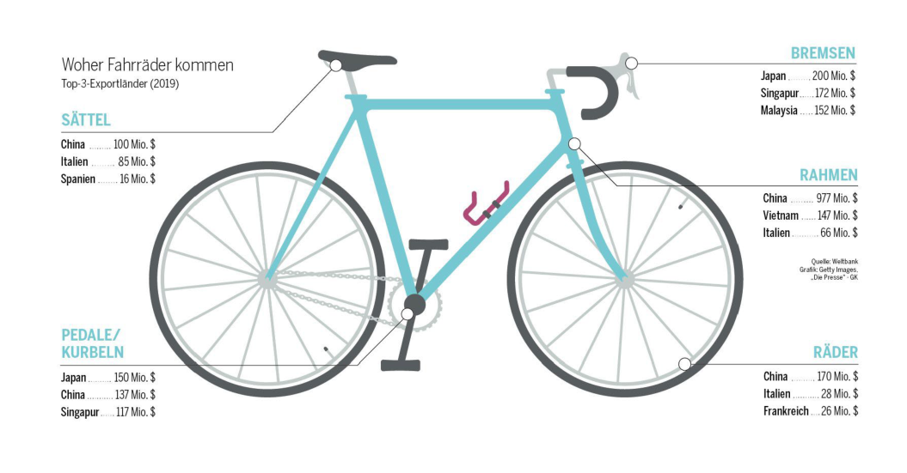

### Преимущества и риски специализации
*   **Преимущества**: Возможность сконцентрироваться на меньшем количестве этапов работы и повысить свою компетентность в этой области. Специализация позволяет производить продукцию в большем объеме (серийное/массовое производство). Больший объем выпуска ведет к снижению **производственных издержек на единицу продукции (Produktionskosten pro Stück)** благодаря **эффекту масштаба (Economies of Scale)** (поскольку постоянные затраты, такие как аренда цеха, распределяются на большее количество единиц продукции). Это снижает цену товара для конечного потребителя.
*   **Зависимость и риски**: Высокая зависимость от других предприятий-поставщиков. Задержки поставок или плохое качество комплектующих могут парализовать все производство компании, привести к потере заказов и ущербу репутации. Такая зависимость особенно опасна в критически важных сферах, например, в производстве лекарств.
*   **Экологические проблемы**: Длинные логистические цепочки (Lieferketten) и доставка комплектующих с разных континентов вызывают высокую нагрузку на окружающую среду из-за выбросов грузового автотранспорта, контейнеровозов и самолетов.

---

## 1.3 Экономическая деятельность означает принятие решений о распределении ограниченных ресурсов (Wirtschaften bedeutet Entscheidungen zu treffen...)

Если бы деньги и блага имелись в неограниченном количестве, обмен благами на деньги был бы простым процессом. Однако это не так: ни одно предприятие не может производить бесконечно много благ, и ни одно частное домохозяйство не обладает неограниченным количеством денег.

> [!NOTE]
> **Что означает ограниченность? (Was bedeutet Knappheit?)**
> Ресурсы, которыми располагают домохозяйства и предприятия, ограничены с обеих сторон. Поэтому ими необходимо «управлять» (хозяйствовать — *wirtschaften*), т. е. тщательно планировать их использование. Сырье, оборудование, рабочая сила, финансовые средства и многое другое доступны в ограниченном объеме.
> Отсюда следует еще один **существенный признак экономики (wesentliches Merkmal der Wirtschaft)**: все экономические субъекты (Wirtschaftsteilnehmer) должны принимать решения о том, на какие из альтернативных вариантов направить свои ограниченные ресурсы. Мы все вынуждены вести хозяйственную деятельность (wirtschaften).

Постоянная необходимость выбора приводит к **основным вопросам экономики (Grundfragen des Wirtschaftens)**:

1.  Что, как, для кого, в каком количестве и какого качества производить?
2.  Что покупать или выменивать?

*   **Пример ограниченности в домохозяйстве**: Семья имеет ограниченный бюджет. Ей приходится решать: сколько потратить на жилье, сколько на транспорт (автомобиль, велосипеды), сколько на ежедневные покупки, сколько отложить (сберечь) или потратить на отпуск.
*   **Пример ограниченности на предприятии**: Предприятиям (таким как Agrana, Rosenbauer, Voest, Do&Co или woom) приходится решать: какие продукты производить, какие средства производства (в каком качестве и количестве) использовать, сколько инвестировать, а сколько ликвидных средств оставить для текущих платежей.

«Суть экономики заключается в признании ограниченности как реальности и в такой общественной организации, которая допускает максимально эффективное использование ресурсов» (Samuelson & Nordhaus 2017).

> [!NOTE]
> **Что такое альтернативные издержки? (Was sind Opportunitätskosten?)**
> Альтернативные издержки (издержки упущенной выгоды) — это недополученный доход или упущенная полезность альтернативного варианта действий, от которого пришлось отказаться в пользу выбранного решения.

*   *Пример 1*: Если ученик использует время для учебы, он не может потратить это же время на тренировку или хобби.
*   *Пример 2*: Если посадить на участке грядки с овощами, на этом месте уже нельзя вырастить цветочную поляну.
*   *Пример 3*: Если вложить деньги в основание компании, их нельзя инвестировать в ценные бумаги для получения дивидендов.
*   *Пример на предприятии*: Основатели *woom GmbH* Кристиан Бездека и Маркус Иленфельд вложили много времени и энергии в создание компании. В это время они могли бы заниматься другой оплачиваемой работой или отдыхать. Упущенный доход от этой деятельности и ценность отдыха составляют их альтернативные издержки.

Осознание ограниченности ресурсов становится ключевым при эксплуатации природы (воздух, вода, почва). Краткосрочные решения часто вызывают долгосрочные экологические и экономические проблемы. **Устойчивое хозяйствование (nachhaltiges Wirtschaften)** означает учет интересов других людей и окружающей среды как сегодня, так и для будущих поколений. Устойчивое поведение объединяет три измерения: **экологию (Ökologie)**, **экономику (Ökonomie)** и **социальную сферу (Soziales)**.

---

## 1.4 Экономический кругооборот — в экономической жизни участвуют многие (Der Wirtschaftskreislauf...)

Никто не ведет хозяйственную деятельность в изоляции. Хозяйствовать — значит вступать в отношения обмена (Austauschbeziehungen), от которых выигрывают обе стороны. Эти отношения формируют **экономический кругооборот (Wirtschaftskreislauf)**. Из-за взаимосвязанности кругооборота экономические проблемы в одной сфере быстро перекидываются на другие (например, во время пандемии коронавируса локдауны снизили потребление домохозяйств, что ударило по продажам фирм, вынудив их сокращать персонал, а государство при этом оказывало финансовую поддержку и тем, и другим).

### Частные домохозяйства, предприятия и государство — основные участники экономики
1.  **Частные домохозяйства (private Haushalte)**: Поставляют рабочую силу предприятиям и государству, получают доходы и предъявляют спрос на потребительские товары.
2.  **Предприятия (Unternehmen)**: Производят товары и услуги, выплачивают заработную плату домохозяйствам и налоги государству.
3.  **Государство (Staat)**: Объединяет все общественные институты, устанавливает правовые рамки, собирает налоги и сборы, предоставляет общественные блага (инфраструктура, школы, больницы, парки) и выплачивает трансферты (субсидии фирмам, семейные пособия гражданам, зарплаты госслужащим — учителям, полицейским, судьям).

> [!NOTE]
> **Как возникает экономический кругооборот?**
> Поскольку все участники обменивают товары и услуги на деньги, между частными домохозяйствами, предприятиями и государством возникают круговые потоки. Внутри экономического кругооборота выделяют:
>
> 1. **Реальный кругооборот / Кругооборот благ (Güterkreislauf)**: движение товаров, услуг и факторов производства (рабочая сила).
> 2. **Денежный кругооборот (Geldkreislauf)**: движение платежей за товары/услуги, налогов, зарплат и трансфертов.

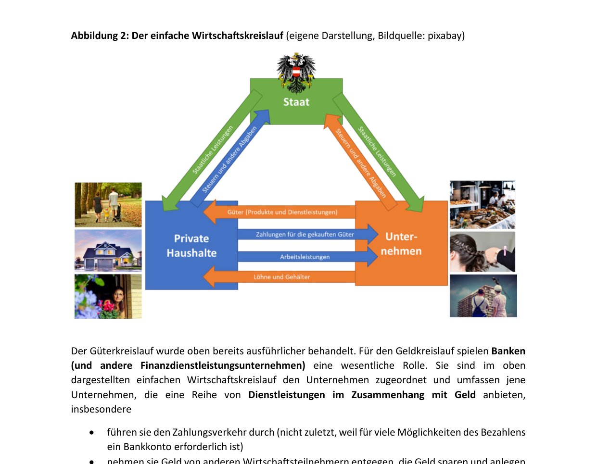

Важную роль в денежном круговороте играют **банки (Banken)** и другие финансовые организации. Они:

*   Осуществляют платежный оборот (проведение безналичных расчетов через банковские счета).
*   Принимают денежные вклады (депозиты) от сберегателей.
*   Предоставляют кредиты нуждающимся в финансировании субъектам.
*   Консультируют по финансовым вопросам.

---

### Рыночные механизмы: Спрос и предложение встречаются на рынке

> [!NOTE]
> **Что понимается под предложением? (Was versteht man unter Angebot?)**
> Предложение товара — это совокупное количество данного блага, которое предлагается к продаже на рынке всеми продавцами.
> 
> **Что понимается под спросом? (Was versteht man unter Nachfrage?)**
> Спрос — это совокупное количество блага, которое экономические субъекты хотят и могут купить.

Рынок — это не обязательно физическое место (магазины, биржи), но и виртуальные площадки (электронные рынки).
> [!NOTE]
> **Что такое рынок? (Was ist der Markt?)**
> Рынок — это «механизм, с помощью которого покупатели и продавцы взаимодействуют друг с другом, чтобы определить цену и количество товара, услуги или актива» (Samuelson & Nordhaus 2017).

Различают рынки: потребительских товаров (Konsumgütermarkt), труда (Arbeitsmarkt), недвижимости (Immobilienmarkt), капитала (Kapitalmarkt), сырья (Rohstoffmarkt), квот на выбросы (Emissionszertifikatemarkt).

Взаимодействие спроса и предложения приводит к **ценообразованию (Preisbildung)**. Цена выражается в денежных единицах и служит индикатором ограниченности блага.

*   Если предложение мало, а спрос велик, цена растет. Высокая цена стимулирует действующих продавцов расширять предложение, а новых — входить на рынок. Рост предложения при неизменном спросе затем ведет к снижению цены.
*   Если спрос низок, а предложение велико, цена падает. Это приводит к тому, что нерентабельные предприятия уходят с рынка (закрываются или перепрофилируются), что снижает предложение и стабилизирует цены.

---

### Международные экономические отношения (Internationale Austauschbeziehungen)

Для открытой малой экономики, такой как Австрия, внешняя торговля имеет решающее значение. Членство в Европейском союзе (ЕС) облегчает торговлю: около 70% австрийского экспорта и импорта приходится на государства-члены ЕС. Важную роль также играет торговля с третьими странами (США, Великобритания, Китай).

> [!TIP]
> **Цифры, даты, факты (Внешняя торговля Австрии в 2023 году)**:
>
> *   Импорт: €201,6 млрд
> *   Экспорт: €200,5 млрд
> *   **Доля экспорта / Квота экспорта (Exportquote)**: Отношение экспорта товаров и услуг к общему ВВП страны составило около 50%.
> *   Каждые 5 из 10 евро, заработанных в Австрии, приходят из внешней торговли.
> *   В индексе глобализации ETH Zurich Австрия занимает 5-е место в мире. По объему экспорта на душу населения среди стран ЕС Австрия занимает 6-е место.

Главные статьи австрийского товарного экспорта — это не шоколад или вафли, а оборудование, транспортные средства, полуфабрикаты и химическая продукция. В сфере услуг доминируют туризм (Urlaubs- und Geschäftsreisen), транспортные и технические услуги, а также информационные услуги.

Австрия подчиняется правилам **Единого рынка ЕС (Binnenmarkt)** с его **четырьмя свободами (vier Grundfreiheiten)**:

1.  Свобода перемещения товаров (freier Warenverkehr).
2.  Свобода перемещения граждан / рабочей силы (freier Personenverkehr).
3.  Свобода предоставления услуг (freier Dienstleistungsverkehr).
4.  Свобода перемещения капитала (freier Kapitalverkehr).

На внешнюю торговлю также влияют правила ВТО (WTO), стандарты устойчивого инвестирования (EU-Taxonomie), руководящие принципы ОЭСР (OECD) для транснациональных компаний, соглашения Базельского комитета в финансовом секторе (Baseler Regelungen), а также соглашения о свободной торговле (например, соглашение ЕС — Меркосур).

---

### Валовой внутренний продукт как мера экономической активности

Для измерения совокупного экономического результата страны используется **Валовой внутренний продукт (ВВП — Bruttoinlandsprodukt, BIP)**.

> [!NOTE]
> **Что такое ВВП? (Was ist das BIP?)**
> ВВП включает все блага (продукты и услуги), произведенные внутри границ страны за определенный период (обычно за год), оцененные по рыночной стоимости (цена × количество). Промежуточные товары и услуги (Vorleistungen) вычитаются из стоимости конечного продукта во избежание двойного счета (например, при производстве пуловера из рыночной стоимости вычитается стоимость шерсти).

ВВП используется для оценки экономического роста.

*   **Номинальный ВВП (nominelles BIP)**: рассчитывается в текущих рыночных ценах. На него влияет инфляция.
*   **Реальный ВВП (reales BIP)**: корректируется с учетом инфляции (изменения уровня цен) и используется для определения фактического экономического роста.

**ВВП на душу населения (BIP pro Kopf)** часто используется как показатель благосостояния (Wohlstand), однако этот подход подвергается критике:

*   ВВП не учитывает качество и экологическую устойчивость роста.
*   ВВП может вырасти вследствие катастроф или аварий, так как они вызывают необходимость проведения восстановительных и ремонтных работ.
*   Производство экологически вредных или опасных для здоровья товаров увеличивает ВВП, несмотря на долгосрочные негативные последствия.
*   ВВП не учитывает безвозмездный домашний труд и уход за близкими (unentgeltliche Pflege- und Sorgearbeit).
*   Тем не менее, ВВП на душу населения коррелирует со средней продолжительностью жизни и уровнем образования.

> [!TIP]
> **Сравнение ВВП на душу населения (2022 год)**:
>
> *   Австрия: €49 400
> *   Средний показатель по ЕС: €35 430
> *   Люксембург (1-е место): €118 320, за ним следуют Ирландия (€98 990) и Дания (€64 450).
> *   Болгария (последнее место): €13 270. В числе аутсайдеров также Румыния (€15 100) и Польша (€17 300).

Другой важный показатель — **Валовой национальный продукт (ВНП — Bruttonationalprodukt, BNP)** или **Валовой национальный доход (ВНД — Bruttonationaleinkommen, BNE)** (ранее назывался *Bruttosozialprodukt, BSP*):

*   **ВВП (BIP)** измеряет все блага, произведенные **внутри границ страны** (территориальный принцип). Доходы иностранцев, работающих в Австрии, входят в ВВП Австрии, но доходы австрийцев, работающих за рубежом, не входят.
*   **ВНП / ВНД (BNP / BNE)** измеряет блага, произведенные с помощью факторов производства, принадлежащих **резидентам данной страны** (гражданам), независимо от географического места их производства. Доходы маятниковых мигрантов (Pendler), приезжающих на работу в Австрию из-за рубежа, входят в ВВП, но исключаются из ВНП.

---

## Рыночные механизмы: Законы предложения и спроса

Цена запускает на рынке ключевые регуляторные механизмы:

1.  **Закон предложения**: Чем выше цена, тем выше предлагаемое количество товара (je höher der Preis, umso höher ist gewöhnlich die angebotene Menge).
2.  **Закон спроса**: Чем выше цена, тем ниже запрашиваемое количество товара (je höher der Preis, umso geringer ist gewöhnlich die nachgefragte Menge).

### 1. Предложение товара и закон предложения
При прочих равных условиях (*ceteris paribus*), количество предлагаемого товара растет по мере увеличения его рыночной цены.

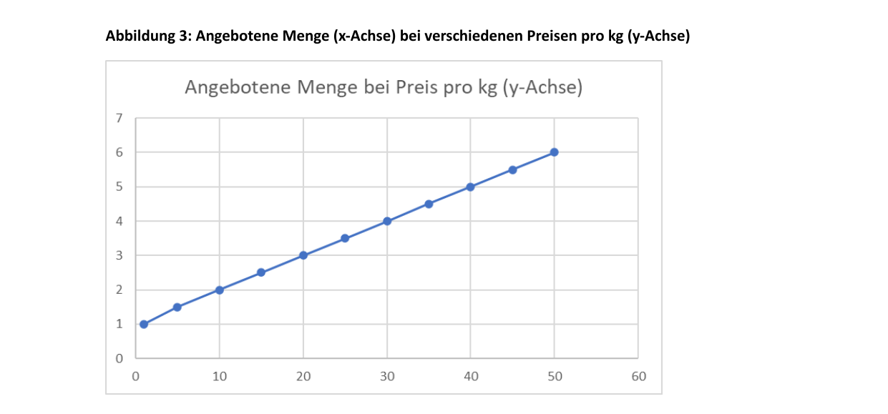

*   **Альтернативные издержки продавцов**: Высокая цена покрывает альтернативные издержки продавцов (если бы они не продавали по этой цене, их упущенная выгода была бы слишком высокой).
*   **Предельные издержки (Grenzkosten)**: Затраты на производство каждой дополнительной единицы продукции называют предельными издержками. У многих компаний предельные издержки растут по мере роста объема выпуска (требуются новые помещения, сверхурочная оплата труда). Увеличение производства выгодно для компании только в том случае, если рыночная цена товара выше или равна его предельным издержкам.

### 2. Спрос на товар и закон спроса
При прочих равных условиях, спрос снижается по мере роста цены. Покупатели при высокой цене отказываются от покупки, сокращают ее объем или переходят на более дешевые товары-заменители (**субституты**).
Готовность платить определенную цену зависит от **полезности (Nutzen)** или степени удовлетворения потребности покупателя.

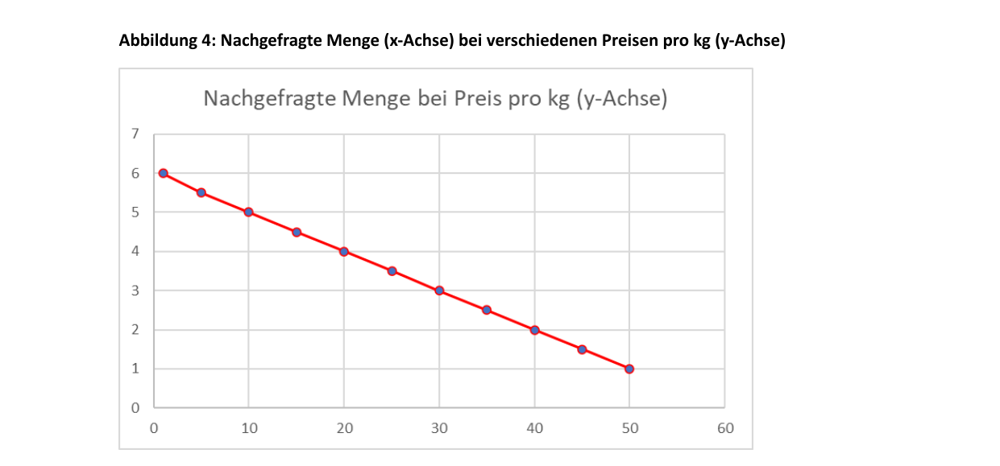

### 3. Рыночное равновесие (Marktgleichgewicht)

> [!NOTE]
> **Равновесная цена (Gleichgewichtspreis) и цена очищения рынка (Markträumungspreis)**:
> В точке рыночного равновесия объем спроса в точности равен объему предложения. На графике это точка пересечения кривых спроса и предложения.
> Рынок при этой цене полностью очищается от излишков и дефицита (поэтому она называется *Markträumungspreis*).

*   **Дефицит / Недостаток (Fehlmenge / Nachfrageüberhang)**: возникает при цене ниже равновесной. Низкая цена стимулирует спрос, но снижает предложение. Возникает избыточный спрос.
*   **Избыток / Затоваривание (Angebotsüberhang)**: возникает при цене выше равновесной. Высокая цена снижает спрос, но увеличивает предложение. Возникает избыточное предложение.
*   **Координационная функция цены (Koordinierungsfunktion des Preises)**: Цена координирует решения покупателей и продавцов. Высокие цены стимулируют предложение и сдерживают спрос (что ведет к снижению цены), а низкие цены стимулируют спрос и сдерживают предложение (что ведет к росту цены).

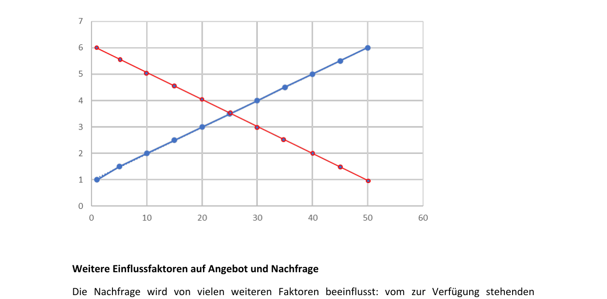

### Другие факторы, влияющие на спрос
Спрос зависит не только от цены данного товара, но и от:

*   **Доходов покупателей (Einkommen)**: При росте доходов кривая спроса сдвигается **вправо** (спрос растет при любой цене). При снижении доходов кривая сдвигается **влево**.
*   **Предпочтений и вкусов (Präferenzen)**: Тренды и мода могут сильно увеличить спрос (например, во время пандемии резко возрос спрос на велосипеды как на безопасный вид транспорта и способ поддержания формы).
*   **Цен на товары-субституты (заменители)**: Спрос падает, если на рынке появляются инновационные или более дешевые альтернативные товары.
*   **Цен на комплементарные (дополняющие) товары**: Товары, которые используются совместно (например, бензин и автомобили, принтеры и картриджи).

### Другие факторы, влияющие на предложение
На предложение влияют:

*   **Количество продавцов на рынке**: Чем больше продавцов заходит на рынок, тем больше предложение (кривая сдвигается вправо).
*   **Ожидания изменения цен**: Если продавцы ждут роста цен в будущем, они могут придержать товар сейчас и увеличить предложение позже.
*   **Технический прогресс и снижение затрат на ресурсы**: Новые технологии снижают себестоимость производства, что позволяет фирмам предлагать больше товаров по более низким ценам.

---

## Различные типы конкуренции на рынке (Wettbewerbssituationen)

Рыночная ситуация зависит от количества продавцов (Anbieter) и покупателей (Nachfrager), а также от наличия близких заменителей товара.

### 1. Монополия (Monopol)
*   **Характеристика**: Один продавец и много покупателей.
*   **Особенности**: Монополии в рыночной экономике редки. Часто монополистом выступает государство или регулируемая им компания (например, железнодорожные перевозки в некоторых регионах) для обеспечения доступных цен на инфраструктуру.
*   *Примечание*: Ситуация с одним покупателем и множеством продавцов называется **монопсонией (Monopson)**.

### 2. Монополистическая конкуренция / Квазимонополия
Компании не являются единственными продавцами, но занимают монопольное положение в определенной нише или локации (например, театральный буфет во время антракта или горная хижина на лыжной трассе). Это позволяет им устанавливать более высокие цены.

### 3. Олигополь (Oligopol)
*   **Характеристика**: Небольшое количество крупных продавцов и много покупателей.
*   **Особенности**: Участники олигополии обладают большой рыночной властью (Marktmacht) и высокой долей рынка (Marktanteil). Конкуренция между ними может быть ожесточенной (например, на рынке мобильной связи, где легко снизить цены). На других рынках (производство пассажирских самолетов) быстро расширить выпуск сложно, поэтому ценовая конкуренция менее выражена.
*   **Картель (Kartell)**: Незаконное соглашение между немногими продавцами олигопольного рынка о ценах или объемах поставок с целью снижения конкурентного давления.
*   *Примечание*: Ситуация со многими продавцами и немногими покупателями называется **олигопсонией (Oligopson)**.

### 4. Полиполия (Polypol) / Совершенная конкуренция (vollkommener Wettbewerb)
*   **Характеристика**: Множество продавцов и покупателей. Ни один из них не может повлиять на рыночную цену (все они являются ценополучателями).
*   **Теоретические допущения совершенного рынка**:
    1.  Полная прозрачность рынка (vollkommene Transparenz) — все знают цены и характеристики товаров у всех продавцов.
    2.  Отсутствие барьеров для входа на рынок и выхода с него.
    3.  Отсутствие личных предпочтений у покупателей (товары абсолютно однородны).

*   На практике эти условия почти никогда не выполняются полностью (наиболее близки рынки стандартизированной сельхозпродукции или финансовые рынки ценных бумаг). Исключениями из правил свободной конкуренции являются **патенты (Patente)**, создающие временную монополию для стимулирования инноваций, или территориальные ограничения (Gebietsschutz) для аптек или трубочистов.

---

## 1.5 Деньги как средство обмена в экономическом кругообороте (Geld als Tauschmittel im Wirtschaftskreislauf)

Без денег торговые отношения были бы крайне затруднены. Пришлось бы использовать бартер (натуральный обмен — *Güter gegen Güter*), требующий двойного совпадения потребностей (если продавцу мяса не нужна одежда, сделка с ткачом не состоится).

### Функции денег (Funktionen von Geld)

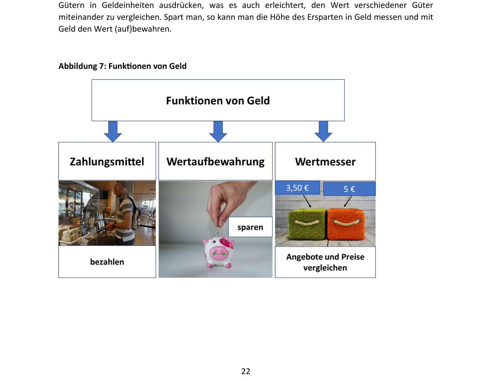

Для выполнения своих функций деньги должны пользоваться **доверием (Vertrauen)** участников рынка. Их ценность (покупательная способность) держится на уверенности в том, что на них всегда можно будет приобрести товары и услуги.

> [!NOTE]
> **Три основные функции денег**:
>
> 1.  **Средство платежа / обмена (Zahlungsmittel / Tauschmittel)**: облегчает совершение сделок купли-продажи.
> 2.  **Мера стоимости (Wertmesser / Recheneinheit)**: выражает ценность различных благ в единых денежных единицах, позволяя их сравнивать.
> 3.  **Средство сбережения / накопления (Wertaufbewahrungsmittel)**: позволяет сохранять стоимость во времени (переносить покупательную способность в будущее).

---

### Формы денег (Formen von Geld)

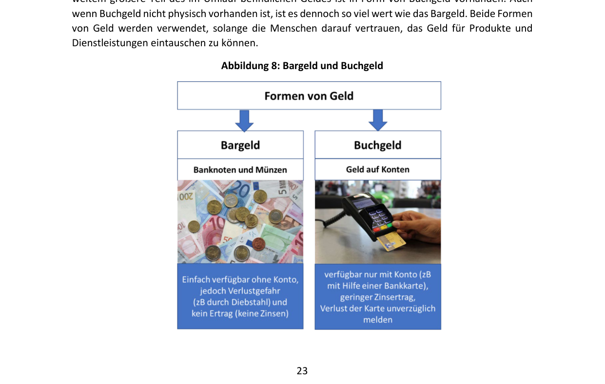

1.  **Наличные деньги (Bargeld)**: банкноты и монеты. Они легко доступны без открытия счета, но не приносят процентов и несут риск кражи.
2.  **Безналичные деньги / Депозитные деньги (Buchgeld / Giralgeld)**:

> [!NOTE]
> Безналичные деньги представляют собой записи на банковских счетах. Они не существуют физически. Владелец распоряжается ими с помощью платежных поручений (переводов), дебетовых или кредитных карт.

Безналичные деньги составляют бóльшую часть денежной массы в обращении. На остатки по счетам банк может начислять проценты.

---

### Валюта и обменные курсы

> [!NOTE]
> **Что такое валюта? (Was ist eine Währung?)**
> Валюта — это установленная законом и признанная государством денежная единица определенной страны. В Австрии официальной валютой является евро (Euro). Любая валюта, отличная от евро, с точки зрения Австрии считается **иностранной валютой (Fremdwährung)**.

Еврозона (Euro-Raum) на май 2024 года включает **20 стран** (около 341 миллиона человек).

*   Еврозона создана в 1999 году с участием 11 стран (наличный евро введен в 2002 году).
*   Этапы расширения: 2001 (Греция), 2007 (Словения), 2008 (Кипр, Мальта), 2009 (Словакия), 2011 (Эстония), 2014 (Латвия), 2015 (Литва), 2023 (Хорватия).

Стоимость одной валюты, выраженная в единицах другой валюты, называется **обменным или валютным курсом (Wechselkurs)**. Курсы постоянно колеблются на валютном рынке.

*   Курс 1 Евро = 1,2 Доллара США означает, что за 1 евро можно получить 1,2 доллара.
*   **Банковские курсы**:
    *   **Курс наличной валюты (Valutenkurs)**: применяется для операций с наличными банкнотами.
    *   **Курс безналичной валюты (Devisenkurs)**: применяется для безналичных расчетов.
    *   **Курс покупки (Ankaufskurs)**: курс, по которому банк покупает иностранную валюту у клиента.
    *   **Курс продажи (Verkaufskurs)**: курс, по которому банк продает иностранную валюту клиенту.

*   **Изменение курсов**:
    *   Если евро дорожает к доллару, европейский турист может позволить себе больше в США.
    *   Если иностранная валюта (например, швейцарский франк) дорожает к евро, то для покупки франков требуется больше евро, и поездка в Швейцарию становится дороже.

*   **Внешний сектор валюты (Außenwert)**: отражает обменный курс валюты по отношению к корзине иностранных валют (multilateraler Wechselkurs), взвешенный по объемам торговли с соответствующими странами.
*   **Котировка валют (Notierung)**:
    *   **Прямая котировка (Preisnotierung)**: количество национальной валюты за единицу иностранной (например, сколько евро стоит 1 доллар).
    *   **Обратная котировка / Объёмная котировка (Mengennotierung)**: количество иностранной валюты за единицу национальной (например, сколько долларов дают за 1 евро). В курсах Венского экономического университета (WU) по умолчанию используется **обратная котировка (Mengennotierung)**.

---

### Деньги имеют цену: Процентные ставки (Zinsen)

> [!NOTE]
> **Что такое проценты? (Zinsen)**
> Проценты — это цена за предоставление денег в долг (плата за пользование чужими деньгами).
>
> *   Тот, кто предоставляет деньги (кредитор — *Gläubiger*), получает проценты.
> *   Тот, кто берет деньги (заемщик / должник — *Schuldner*), выплачивает проценты.
> *   Банк выступает заемщиком, когда принимает вклады от клиентов, и кредитором, когда выдает кредиты.

### Почему существуют проценты? (Причины начисления процентов)

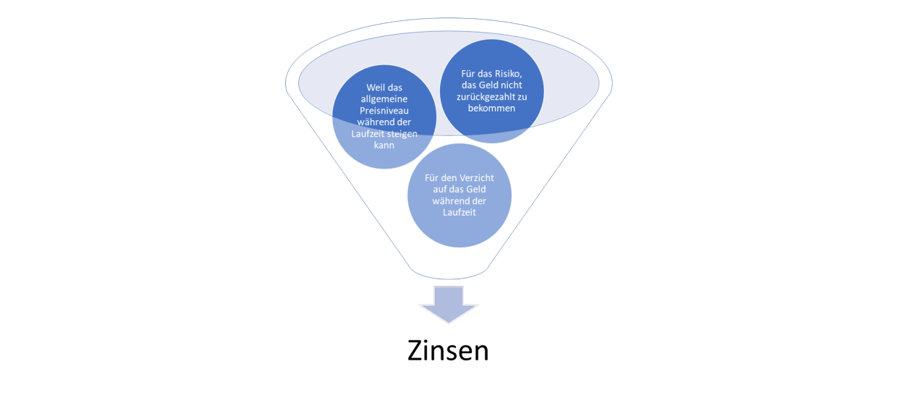

1.  **Риск невозврата (Dubiosenrisiko)**: Кредитор рискует тем, что должник не сможет вернуть сумму долга, и требует плату за этот риск.
2.  **Отказ от потребления / Альтернативные издержки (Konsumverzicht / Opportunitätskosten)**: Кредитор лишается возможности тратить или иным образом инвестировать свои деньги в период займа.
3.  **Риск снижения стоимости денег (Geldwertrisiko)**: В течение срока займа цены могут вырасти (инфляция), и возвращенная сумма будет иметь меньшую покупательную способность, чем при выдаче кредита.

Процентные ставки формируются под влиянием спроса и предложения на финансовом рынке.

*   При низких ставках кредиты дешевы («дешевые деньги» — *billiges Geld*), спрос на них растет.
*   Бурный рост спроса на кредиты толкает процентную ставку вверх, что постепенно охлаждает спрос.
*   Если спрос на кредиты падает, банки снижают процентные ставки для его стимулирования.

Процентная ставка по кредиту для конкретного клиента зависит от:

*   Стоимости привлечения средств банком (**затраты на рефинансирование — Refinanzierungskosten**).
*   Оценки надежности заемщика (**стоимость риска — Risikokosten**).
*   Административных расходов банка и планируемой маржи прибыли.

### Расчет процентов (Zinsberechnung)

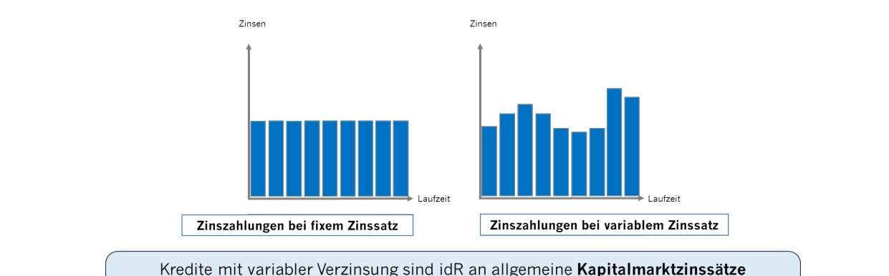

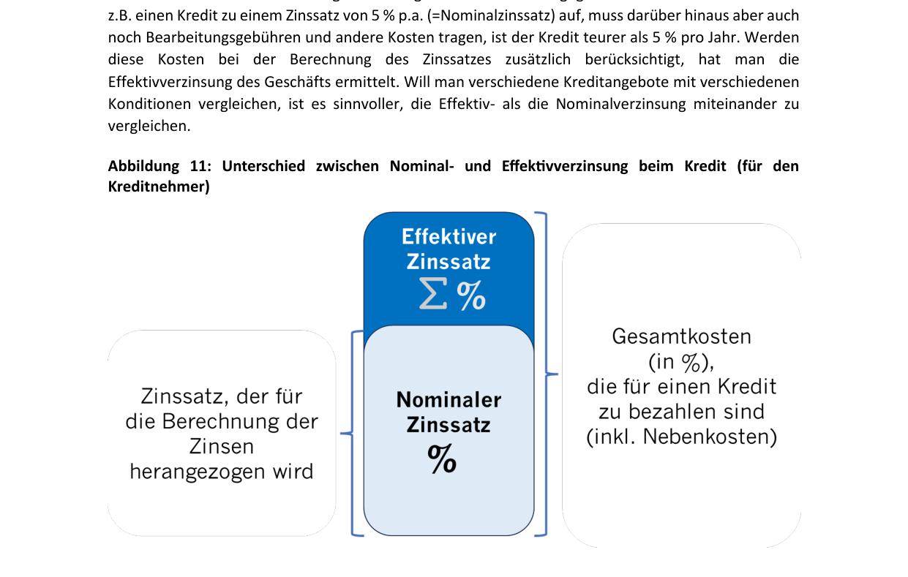

Для расчета простых процентов используется классическая формула:

$$\text{Zinsen (Z)} = K \times \frac{p}{100} \times \frac{t}{360}$$

Где:

*   \(K\) — изначальный капитал (**Kapital**).
*   \(p\) — процентная ставка (**Zinssatz** в % p.a.).
*   \(t\) — количество дней начисления (**Tage**). В коммерческих расчетах год принимается равным 360 дням, а месяц — 30 дням.

Проценты рассчитываются за определенный период (обычно в процентах годовых — **% p.a.**, *per annum*).

*   **Сложные проценты (Zinseszinsen)**: если проценты за период не выплачиваются, а прибавляются к сумме основного долга/вклада, в следующем периоде проценты начисляются уже на эту новую, увеличенную сумму («проценты на проценты»).
*   **Фиксированная ставка (fixer Zinssatz)**: остается неизменной на протяжении всего срока кредита/депозита.
*   **Плавающая ставка (variabler Zinssatz)**: меняется во времени в зависимости от рыночной конъюнктуры. Европейский центральный банк (ЕЦБ / EZB) повышает процентные ставки для борьбы с инфляцией, что автоматически увеличивает расходы заемщиков с плавающими ставками по кредитам.
*   **Номинальная и эффективная ставка (Nominal- und Effektivverzinsung)**:
    *   **Номинальная ставка (Nominalzinssatz)**: процентная ставка, указанная в договоре для расчета процентных платежей.
    *   **Эффективная ставка (Effektivzinssatz)**: отражает полную стоимость кредита для заемщика (или полную доходность вклада), учитывая не только проценты, но и сопутственные комиссии, сборы и условия начисления.

> [!TIP]
> **Налог на прирост капитала в Австрии (Kapitalertragsteuer, KESt)**:
> Процентные доходы по банковским вкладам физических лиц в Австрии облагаются налогом на прирост капитала. Банк автоматически удерживает налог (KESt) в конце расчетного периода и перечисляет его в налоговые органы (Finanzamt). На счет клиента зачисляются проценты уже за вычетом этого налога.

---

## Ценность денег и инфляция

Для выполнения деньгами своих функций критически важна их стабильность во времени.

> [!NOTE]
> **Что такое инфляция? (Was ist Inflation?)**
> Инфляция — это устойчивый рост общего уровня цен на товары и услуги в экономике. При инфляции падает ценность (покупательная способность — *Kaufkraft*) денег: на одну и ту же сумму через год можно купить меньше товаров, чем в начале года.

*   **Внутренняя стоимость денег (Binnenwert)**: покупательная способность национальной валюты на внутреннем рынке (сколько товаров можно купить внутри страны). Инфляция снижает внутреннюю стоимость денег.
*   **Внешняя стоимость денег (Außenwert)**: покупательная способность валюты при обмене на иностранные валюты (валютный курс).

### Причины инфляции (Ursachen von Inflation)

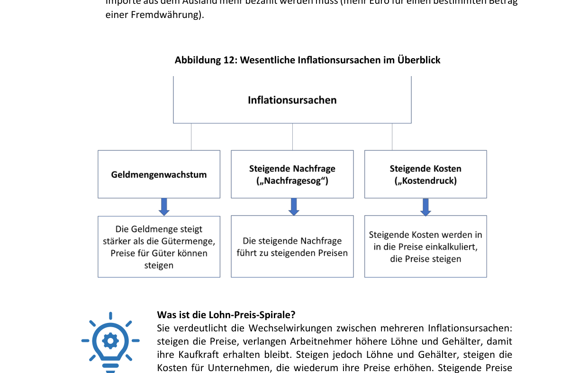

1.  **Рост денежной массы (Geldmengenwachstum)**: Возникает, когда объем денег в обращении растет быстрее, чем объем предлагаемых товаров и услуг. Этому способствует эмиссия денег центральными банками или активная выдача кредитов коммерческими банками (**создание безналичных денег — Buchgeldschöpfung**). Если избыточные деньги направляются на потребление и инвестиции, цены растут. Для борьбы с этим ЦБ повышают процентные ставки, удорожая кредиты и связывая денежную массу.
2.  **Избыточный спрос / «Инфляция спроса» (Nachfragesog)**: Возникает, когда совокупный спрос со стороны домохозяйств и бизнеса превышает возможности производства. Спрос «тянет» цены вверх.
3.  **Рост издержек / «Инфляция издержек» (Kostendruck)**: Вызывается ростом цен на сырье, энергоносители, увеличением налогов или ростом заработной платы. Производители перекладывают возросшие затраты на конечных потребителей, повышая цены. Рост цен на импортируемые ресурсы называют **импортируемой инфляцией (importierte Inflation)**.

> [!NOTE]
> **Спираль «зарплата — цены» (Lohn-Preis-Spirale)**:
> Демонстрирует взаимосвязь факторов инфляции: рост цен заставляет работников требовать повышения заработной платы для сохранения покупательной способности. Повышение зарплат увеличивает издержки предприятий, которые они компенсируют новым повышением цен на свои товары, что провоцирует новые требования о росте зарплат.

### Измерение инфляции (Messung von Inflation)
Уровень инфляции измеряется с помощью **Индекса потребительских цен (ИПЦ — Verbraucherpreisindex, VPI)**.

Формула расчета уровня инфляции (в процентах):

$$\text{Inflationsrate (\%)} = \frac{\text{VPI}_{\text{neu}} - \text{VPI}_{\text{alt}}}{\text{VPI}_{\text{alt}}} \times 100$$

Где:

*   \(\text{VPI}_{\text{neu}}\)_ — индекс потребительских цен в отчетном (новом) периоде.
*   \(\text{VPI}_{\text{alt}}\) — индекс потребительских цен в базисном (прошлом) периоде.

*   **Потребительская корзина (Warenkorb)**: В Австрии включает около **800 товаров и услуг**, составляющих типичные расходы среднего домохозяйства (продукты питания, жилье, энергия, досуг). Состав корзины обновляется каждые 5 лет.
*   **Гармонизированный индекс потребительских цен (ГИПЦ — Harmonisierte Verbraucherpreisindex, HVPI)**: используется для сопоставления инфляции между странами ЕС и для оценки стабильности цен в еврозоне.
*   **Микрокорзина (Mikrowarenkorb)**: отражает динамику цен на товары ежедневного спроса (хлеб, молоко, газеты). Колебания цен здесь обычно выше среднего ИПЦ.
*   **Миникорзина (Miniwarenkorb)**: отражает динамику цен на товары еженедельного спроса (заправка авто, еженедельные закупки).

### Целевой показатель инфляции 2%
Европейский центральный банк считает оптимальным поддержание инфляции на уровне **2% в год**. Это обеспечивает стабильность цен (Preisstabilität).

*   Инфляция на уровне 0% нежелательна, так как несет риск скатывания в **дефляцию (Deflation)** — устойчивое снижение цен. При дефляции ценность денег растет, из-за чего потребители откладывают покупки в ожидании еще более низких цен, что парализует экономическую активность.

---

### 🎓 Разбор экзаменационных вопросов и ловушек (Prüfungsfallen) по Главе 1

> [!WARNING]
> **Ловушка 1: Территориальный vs. Национальный принципы в ВВП и ВНП/ВНД**
>
> *   **ВВП (BIP)** базируется на **территориальном принципе (Inlandskonzept)**: учитывается всё, что произведено *внутри географических границ страны*, неважно кем. Доходы иностранцев, работающих в Австрии, входят в ВВП Австрии.
> *   **ВНП / ВНД (BNP / BNE)** базируется на **национальном принципе (Inländerkonzept)**: учитывается всё, что произведено *гражданами (резидентами) страны*, независимо от того, где физически это производится.
> *   *Экзаменационный вопрос (типа Aufgabe 6e)*: Утверждение «Das BIP basiert auf dem Inländerkonzept...» является **НЕВЕРНЫМ**. Правильно: «Das BIP basiert auf dem Inlandskonzept...» (а BNP — на *Inländerkonzept*).
> 
> **Ловушка 2: Состав ВВП и неоплачиваемый труд**
>
> *   ВВП (BIP) измеряет блага, имеющие рыночную стоимость. Он **НЕ включает** неоплачиваемый домашний труд и уход за близкими (**unentgeltliche Pflege- und Sorgearbeit**).
> *   *Экзаменационный вопрос (типа Aufgabe 6d)*: Утверждение «Das BIP umfasst... auch unentgeltliche Pflege- und Sorgearbeit» является **НЕВЕРНЫМ**.
> 
> **Ловушка 3: Борьба с инфляцией через процентные ставки**
>
> *   Для снижения инфляции центральный банк проводит **повышение ключевой ставки (Leitzinserhöhung)**, чтобы сделать кредиты дороже и уменьшить денежную массу.
> *   *Экзаменационный вопрос (типа Aufgabe 9c)*: Утверждение «Um Inflationsraten zu reduzieren, kann die Zentralbank eine Leitzinssenkung durchführen» (снижение ставки) является **НЕВЕРНЫМ**. Правильно: *Leitzinserhöhung* (повышение ставки).

