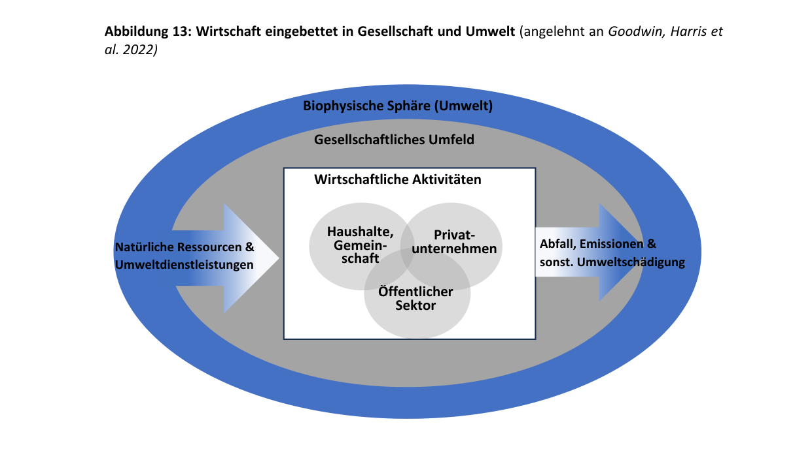
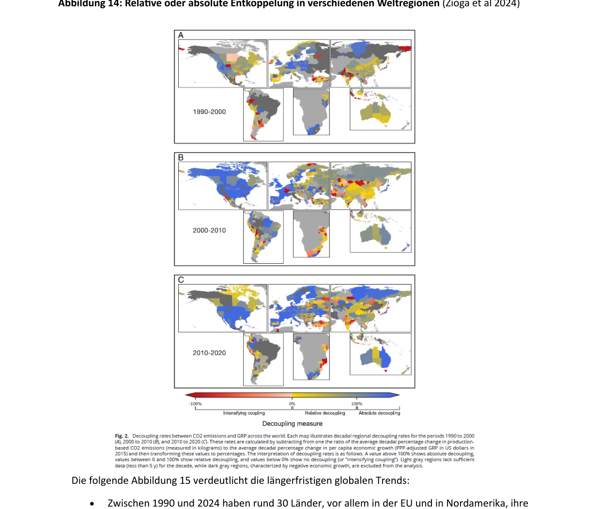
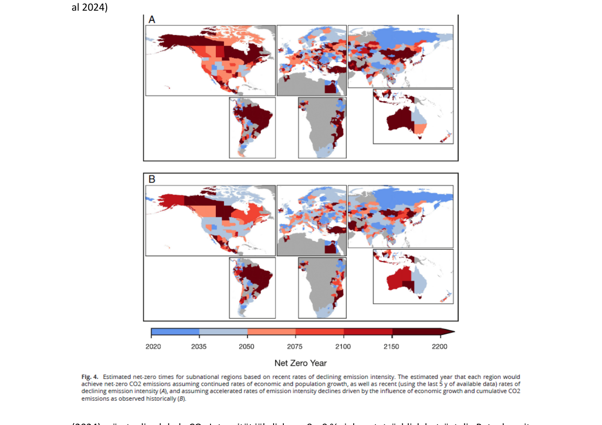
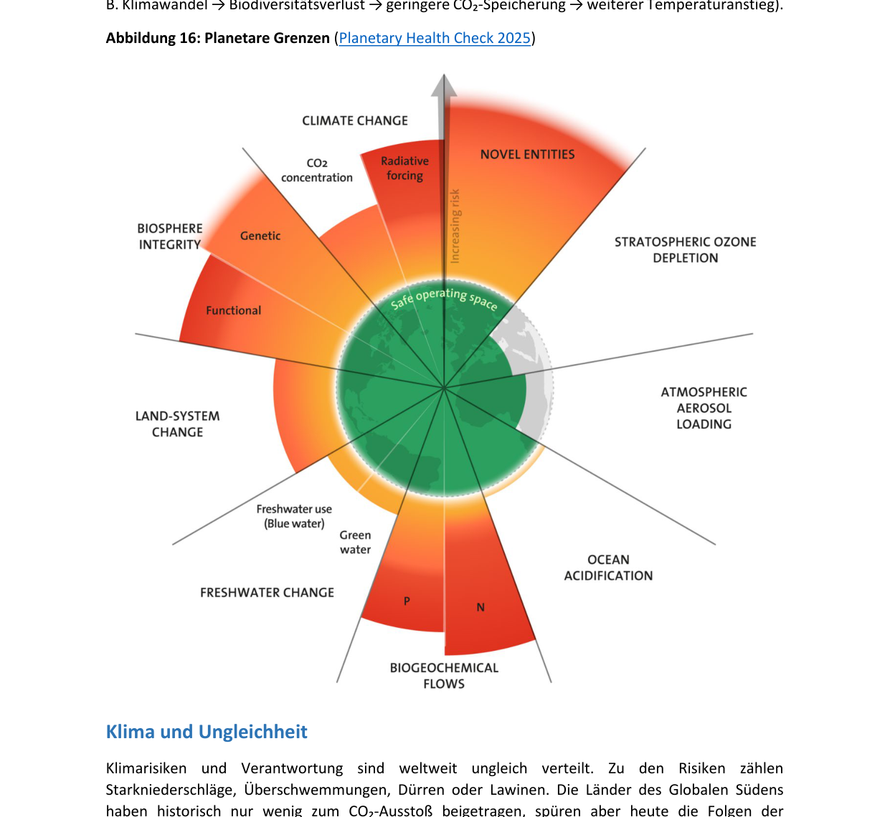
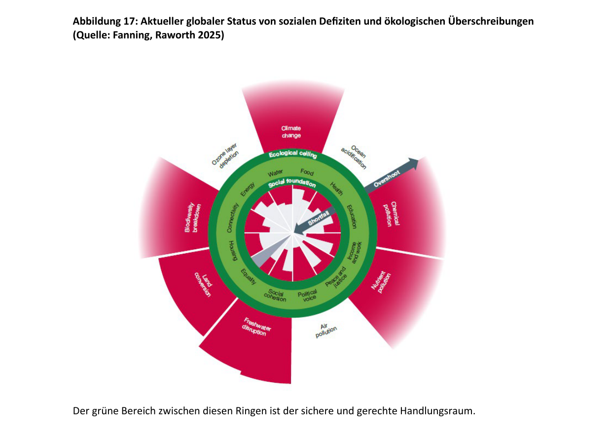

# Глава 2: Экономика как часть общества и окружающей среды (Wirtschaft als Teil der Gesellschaft und Umwelt)

Благополучие людей, успех экономики и стабильность земной системы тесно взаимосвязаны. Экономика — это не изолированная, самодостаточная система, она встроена в общество и природу. Предприятия являются не просто производителями, но и социальными акторами, которые создают рабочие места, формируют условия труда, берут на себя социальную ответственность и способствуют внедрению инноваций.

В то же время общество формирует экономику множеством способов: оно обеспечивает **институциональные рамки (institutionelle Rahmenbedingungen)**, такие как законы, права собственности, трудовые и социальные стандарты, которые снижают экономическую неопределенность и создают стабильность. Через образование, профессиональную подготовку и исследования общество обеспечивает квалификацию рабочей силы, а за счет социального сплочения и доверия способствует функционированию рынков и организаций. Общество и государство образуют не просто контекст, но и важнейший ресурс экономики — они обеспечивают сотрудничество, предсказуемость планирования и способность к инновациям.

Все виды экономической деятельности зависят от природных ресурсов и **экосистемных услуг (Umweltdienstleistungen)**: вода, почва, энергия и биоразнообразие являются необходимыми условиями человеческого существования. Экономическая деятельность всегда осуществляется в рамках социальных структур и экологических границ.

---

## 2.1 Встроенность экономики в общество и окружающую среду (Einbettung der Wirtschaft in Gesellschaft und Umwelt)

Услуги природы не только незаменимы для производства благ (например, продуктов питания и ноутбуков) и услуг (например, туризма и страхования), но и составляют основу нашей экономической системы. 

Экономическая деятельность осуществляется частными предприятиями, государственным сектором (Staat und NGOs), а также домашними хозяйствами и сообществами. Экономика извлекает **ресурсы (Inputs)** (природные богатства и экосистемные услуги, например, опыление продовольственных культур) из земной системы и возвращает в нее **отходы (Outputs)** (парниковые газы, мусор и т.д.), то есть в биофизическую сферу.

> [!NOTE]
> **Важнейшие атмосферные парниковые газы (Treibhausgase)**:
> К ним относятся водяной пар, углекислый газ (CO2), метан (CH4), оксид азота (N2O, также называемый закисью азота или веселящим газом) и озон (O3). Они образуют в атмосфере своего рода изолирующий слой, удерживающий часть тепла, излучаемого земной поверхностью. В результате человеческой деятельности (сжигание ископаемого топлива, вырубка лесов, интенсификация сельского хозяйства) концентрация этих газов растет, что ведет к росту глобальной средней температуры и ускоряет **изменение климата (Klimawandel)**.

Рыболовство, сельское и лесное хозяйство, а также туризм в высокой степени зависят от наличия природных ресурсов и неповрежденных экосистем. Их долгосрочное существование напрямую зависит от сохранения и устойчивого использования этих природных основ.

Экономика встроена в социальную среду, которая формируется различными акторами:

*   **Государство (Staat)**: играет центральную роль, принимая законы, обеспечивая соблюдение нормативных требований и создавая экономические условия (например, через налоговую политику или экологические требования).
*   **Предприятия (Unternehmen)**: действуют в этих рамках, но также активно влияют на них через лоббирование (Lobbying), саморегулирование и инициативы в области **корпоративной социальной ответственности (Corporate Social Responsibility, CSR)**.
*   **Гражданское общество (Zivilgesellschaft)** (НКО, ассоциации, наука и СМИ): выступает в роли критического института, который подвергает сомнению экономические действия, тематизирует недостатки и формулирует общественные ожидания относительно устойчивого и этичного ведения бизнеса.
*   **Индивидуальные и коллективные акторы** (потребители и работники): своим поведением (решения о покупке, мобильность рабочей силы, протесты) формируют экономические структуры и нормы. Взаимодействие этих акторов показывает, что экономические процессы всегда являются результатом социальных и политических переговоров.

### Последствия разрушения окружающей среды
Разрушение окружающей среды оборачивается для экономики значительными издержками:

*   **Прямые последствия**: разрушение инфраструктуры в результате экстремальных погодных явлений, перебои в производстве и рост страховых исков.
*   **Косвенные последствия**: неурожаи, рост расходов на здравоохранение и потери производительности.
*   **Долгосрочные последствия**: деградация экосистем, климатическая миграция, рост инвестиционных рисков и сбои в глобальных цепочках поставок.

Здоровые экосистемы служат естественной защитой от стихийных бедствий. Например, леса могут предотвращать или смягчать наводнения, накапливая дождевую воду и контролируемо высвобождая ее. В высокогорных районах они служат естественными барьерами против лавин, защищая поселения и дороги. Водно-болотные угодья (Feuchtgebiete) действуют как губки, впитывая и удерживая паводковые воды.

Разнообразие видов (биоразнообразие — *Biodiversität*) в экосистеме повышает ее устойчивость. Оно позволяет экосистеме адаптироваться к изменениям и быстрее восстанавливаться после сбоев. Защищая биоразнообразие, мы способствуем стабильности природных систем, что укрепляет сообщества, зависящие от этих экосистем. Биоразнообразие также является важным источником инноваций для фармацевтики, биотехнологий и сельского хозяйства.

---

## 2.2 Устойчивое развитие (Nachhaltigkeit)

> [!NOTE]
> **Что означает устойчивость / устойчивое развитие? (Was bedeutet Nachhaltigkeit?)**
> Устойчивость означает, что совместная система экономики и окружающей среды способна удовлетворять потребности людей и в будущем.

Успешная в долгосрочной перспективе экономическая деятельность требует, чтобы предприятия и потребители учитывали последствия своих решений для других людей и окружающей среды. Система считается устойчивой, если экономическая деятельность осуществляется в биофизических границах планеты без разрушения естественных основ жизни. Устойчивые экономические структуры призваны удовлетворять потребности всех людей, одновременно способствуя социальной инклюзии (социальной интеграции — *soziale Inklusion*) и социальному сплочению. Ключевым фактором является то, как ресурсы извлекаются, используются и возвращаются в круговорот во избежание превышения экологических пределов. 

### Линейная модель против циркулярной экономики
*   **Линейная модель («Take – Make – Waste» / «Взять — произвести — выбросить»)**: Сырье извлекается, продукты производятся, потребляются и затем утилизируются без учета экологических последствий добычи ресурсов, выбросов или отходов. Такая модель ведет к росту загрязнения окружающей среды, истощению ресурсов и дестабилизирует ключевые системы (климат, биоразнообразие, земельные и водные ресурсы).
*   **Циркулярная (круговая) экономика (Kreislaufwirtschaft)**:

> [!NOTE]
> В циркулярной экономике отходы минимизируются, а ресурсы удерживаются в экономическом круговороте как можно дольше посредством повторного использования, ремонта или переработки продуктов, материалов и сырья. Цель состоит в сохранении ценности ресурсов для снижения экологической нагрузки и получения экономических преимуществ.
> Связанные концепции: ремонтный бонус (Reparaturbonus), экологичный дизайн (Circular Design), долговечные продукты, вторичная переработка городского сырья (Urban Mining).

### Проблема бедности
Трансформация экономики также направлена на борьбу с бедностью:

*   Около 700 млн человек (8,5% мирового населения) живут в **экстремальной бедности (extreme Armut)** — менее чем на 2,15 доллара в день (в основном в Африке к югу от Сахары).
*   Около 3,5 млрд человек (44% населения планеты) считаются бедными при черте бедности 6,85 доллара в день (показатель для стран со средним уровнем дохода).
*   **В Австрии** понятие бедности иное: люди считаются находящимися под угрозой бедности (**armutsgefährdet**), если их доход ниже порога риска бедности, который в 2023 году составлял **€1 572 в месяц** для домохозяйства из одного человека (14,9% населения Австрии, около 1 314 000 человек).

Экономический рост часто рассматривается как решение проблемы бедности. Это создает **дилемму**: с одной стороны, текущий уровень глобальной экономической активности уже превышает несколько планетарных границ, с другой стороны, рост считается необходимым для сокращения бедности. Меры по борьбе с бедностью, основанные на ресурсоемком росте, могут создавать новые риски. Устойчивая трансформация требует подходов, которые обеспечивают экономическое развитие в биофизических границах планеты и способствуют социальной справедливости.

### Исторический контекст и доклады
Одним из важнейших докладов XX века стал **«Наше общее будущее» (Our Common Future)**, опубликованный в 1987 году Всемирной комиссией по окружающей среде и развитию (WCED) и также известный как **«Доклад Брундтланд» (Brundtland-Bericht)** (по имени председателя комиссии Гру Харлем Брундтланд). 
Доклад ввел понятие **устойчивого развития (nachhaltige Entwicklung)**: это форма развития, которая удовлетворяет потребности настоящего времени, не ставя под угрозу способность будущих поколений удовлетворять свои собственные потребности. В качестве путей достижения предлагались: шеринговые модели (Sharing-Modelle), долговечный дизайн, восстановление бывших в употреблении деталей (Remanufacturing).

В рамках **Европейского зеленого курса (European Green Deal, EGD)** устойчивость стала ключевым понятием европейской экономической политики. С 2022 года отчетность в области устойчивого развития (Nachhaltigkeitsberichterstattung) является обязательной для крупных компаний, а **Классификация экологически устойчивых видов деятельности (EU-Taxonomie)** призвана способствовать экологическому инвестированию на рынке капитала.

> [!NOTE]
> **Происхождение термина «устойчивость»**:
> Термин изначально возник в лесном хозяйстве (Forstwirtschaft) и означал практику вырубки не большего количества деревьев, чем может вырасти вновь, для обеспечения стабильного получения древесины в долгосрочной перспективе.

### Две концепции устойчивости
1.  **Слабая устойчивость (schwache Nachhaltigkeit)**: Базируется на трехкомпонентной модели (Drei-Säulen-Modell), рассматривающей экологию, социальную сферу и экономику как равноценные столпы. Предполагает возможность компенсации потерь в одной области выгодами в другой. Природные ресурсы могут замещаться человеческими знаниями или капиталом, если совокупный капитал — природный (Naturkapital: леса, недра), человеческий (Humankapital: образование, квалификация) и физический (Sachkapital: заводы, машины) — остается стабильным или растет.
2.  **Сильная устойчивость (starke Nachhaltigkeit)**: Подчеркивает фундаментальное значение экологических систем для экономики и общества. Определенные экологические функции (например, стабильный климат) незаменимы и не могут быть замещены экономическим или человеческим капиталом. Данная концепция требует сохранения естественных экосистем в максимально возможной степени.

---

## 2.3 Разделение экономического роста и экологического ущерба? (Entkopplung von Wirtschaftswachstum und Umweltschäden?)

Целью устойчивой экономической политики является ослабление связи между экономическим успехом и экологической нагрузкой. В прошлом рост ВВП был тесно связан с ростом потребления энергии, сырья и площадей, а также с ростом выбросов.

> [!NOTE]
> **Что такое разделение / декаплинг? (Entkopplung / Decoupling)**
> Это процесс, при котором экономическое развитие и экологический ущерб отделяются друг от друга. Цель состоит в обеспечении благополучия и качества жизни без роста потребления ресурсов и объема выбросов.

Различают две формы разделения:

1.  **Относительное разделение (relative Entkopplung)**: Экологический ущерб растет медленнее, чем экономические показатели. Выбросы или потребление ресурсов увеличиваются, но менее высокими темпами, чем ВВП (например, ВВП вырос на 3%, а выбросы CO2 — на 1%). Экологическая нагрузка продолжает увеличиваться, но медленнее.
2.  **Абсолютное разделение (absolute Entkopplung)**: Экологическая нагрузка снижается в абсолютном выражении, в то время как экономические показатели продолжают расти (например, ВВП вырос на 3%, а выбросы CO2 снизились на 4%).

Только абсолютное разделение гарантирует, что экономическое развитие не происходит за счет экологической стабильности.

### Эмпирические данные

*   Абсолютное разделение было успешно достигнуто для некоторых локальных загрязняющих веществ, таких как диоксид серы (SO2) или хлорфторуглероды (ХФУ / FCKW), благодаря технологическим альтернативам и международным соглашениям (Монреальский протокол).
*   В случае с выбросами CO2 абсолютное разделение дается намного сложнее. Электрификация транспорта, логистики и теплоснабжения ведет к росту эффективности, однако выбросы парниковых газов в промышленности остаются тесно связанными с энергопотреблением.
*   Технологии очистки на выходе (**«End-of-Pipe»-Technologien**, например, фильтры) разработаны для SO2 и ХФУ, но для полного улавливания CO2 масштабируемых технологий пока нет. Улавливание и хранение углерода (**Carbon Capture and Storage, CCS**) технически возможно, но дорого и энергоемко. В Австрии технология CCS разрешена только для отраслей с трудносокращаемыми выбросами (**«hard-to-abate»-Branchen**, например, цементная промышленность или утилизация отходов).

### Структурные вызовы
1.  **Утечка углерода (Carbon Leakage)**: Перенос производства и выбросов в другие регионы мира с менее строгими экологическими стандартами. В таком случае снижение выбросов в одной стране компенсируется их ростом в другой.
2.  **Эффект отскока (Rebound-Effekte)**: Рост эффективности снижает издержки, что часто ведет к увеличению совокупного спроса на энергию и товары (например, более экономичные приборы используются чаще или покупаются в большем объеме, что нивелирует экономию ресурсов).

Абсолютное разделение требует не только технологий, но и политических мер (налогообложение CO2, субсидирование возобновляемых источников энергии), системных изменений в энергетике, транспорте и продовольственной сфере, а также изменения поведения потребителей и бизнеса.

В период с 1990 по 2024 год около 30 стран (в основном в ЕС и Северной Америке) добились абсолютного сокращения выбросов CO2 при одновременном росте ВВП. Глобальная эмиссия CO2 на единицу ВВП (**эмиссионная интенсивность — Emissionsintensität**) снизилась примерно на 40%, но общие мировые выбросы продолжили расти, так как экономический рост перекрыл рост эффективности. Для достижения климатической нейтральности к 2050 году глобальная интенсивность выбросов CO2 должна снижаться на 8–9% ежегодно (сейчас этот показатель составляет менее 2%).

---

## 2.4 Экономическая деятельность в пределах планетарных границ (Wirtschaften innerhalb der Erdsystemgrenzen)

Экономическая деятельность в рамках планетарных границ требует соблюдения ограничений по выбросам.

> [!NOTE]
> **Углеродный бюджет (Kohlenstoffbudget)**:
> Максимальное количество углекислого газа (CO2), которое еще может быть выброшено в атмосферу в глобальном масштабе без превышения определенного температурного предела (например, 1,5°C или 2°C по сравнению с доиндустриальным уровнем), установленного Парижским соглашением по климату 2015 года.

Оставшийся углеродный бюджет для удержания потепления в пределах 1,5°C (с вероятностью 50%) составляет около **380 миллиардов тонн CO2 (GtCO2)**. При текущих темпах выбросов этот бюджет будет исчерпан всего за 9 лет. В Австрии выбросы парниковых газов начали снижаться в 2022 году, однако темпы сокращения не соответствуют целям Регламента ЕС о совместном распределении усилий (Effort-Sharing-Verordnung).

Порог в 1,5°C является важным ориентиром, но ученые (например, Йохан Рокстрём) отмечают, что это скорее политически выбранный предел риска, основанный на превентивных соображениях, а не фиксированная физическая граница. Превышение этого порога опасно из-за существования **точек перелома / критических элементов земной системы (Kippelemente)**. Эти системы (гренландский и западноантарктический ледяные щиты, атлантическая меридиональная циркуляция, тропические коралловые рифы) при потеплении от 1,5°C до 2°C могут перейти в нестабильное состояние, вызвав необратимые изменения.

Климатический кризис — лишь одна из нескольких границ земной системы. Учеными были определены **девять планетарных границ (planetary boundaries)**, превышение которых создает значительные риски:

> [!TIP]
> **Текущий статус планетарных границ (по данным Planetary Health Check 2025)**:
> Семь из девяти планетарных границ уже превышены:
>
> 1.  **Климатическая система (Klimasystem)**: глобальное потепление \(\approx 1,2^\circ\text{C}\); концентрация \(CO_2 > 420\text{ ppm}\).
> 2.  **Целостность биосферы (Integrität der Biosphäre)**: массовая утрата биоразнообразия, темпы вымирания видов более чем в 100 раз превышают естественный уровень.
> 3.  **Изменение землепользования (Landnutzungsänderung)**: более 40% свободной ото льда суши используется под нужды сельского хозяйства.
> 4.  **Биогеохимические циклы (Biochemische Kreisläufe)** (азот и фосфор): широко распространенное закисление почв и евтрофикация (загрязнение удобрениями водоемов).
> 5.  **Доступность пресной воды (Süßwasserverfügbarkeit)**: изъятие воды в глобальном масштабе превышает возможности ее естественного восполнения.
> 6.  **Введение новых веществ (Einbringung neuartiger Substanzen)**: накопление в окружающей среде химикатов, микропластика и пестицидов.
> 7.  **Закисление океана (Versauerung der Ozeane)**: падение уровня pH превысило безопасный порог.
> 
> **В пределах безопасной зоны (sicherer Bereich)**:
>
> 8.  **Стратосферный озон (Stratosphärisches Ozon)**: успешное восстановление благодаря Монреальскому протоколу.
> 9.  **Аэрозольная нагрузка на атмосферу (Atmosphärische Aerosolbelastung)**: в глобальном масштабе находится в пределах зоны допуска, но критична на региональном уровне.

### Климат и неравенство
Климатические риски и ответственность распределены крайне неравномерно:

*   Страны Глобального Юга исторически внесли минимальный вклад в выбросы CO2, но сильнее всего страдают от засух, наводнений и экстремальных осадков.
*   **Историческая ответственность за выбросы**: США — 40%, страны ЕС-28 — 29%, остальная Европа — 13%, прочий Глобальный Север — 10%, Глобальный Юг — 8%.
*   Самый богатый 1% населения планеты ответственен за вдвое больший объем выбросов CO2, чем беднейшие 50%. В 2021 году выбросы 10% самых богатых людей составляли в среднем 22 тонны CO2 на душу населения (более чем в 200 раз превышает уровень беднейших 10%). Если богатейшие 10% сохранят текущий уровень потребления, они одни исчерпают оставшийся углеродный бюджет к 2046 году.

---

## 2.5 Социальное благополучие как цель устойчивого хозяйствования (Soziales Wohlbefinden...)

Центральным вопросом экономики является ее назначение. Если экономика не служит благополучию людей (Wohlbefinden), она теряет свою легитимность.

### Потребности, предпочтения, полезность
Для анализа благополучия важно различать следующие понятия:

*   **Потребности (Bedürfnisse)**: Объективные предпосылки человеческого существования (питание, здоровье, социальная принадлежность, безопасность). Они имеют этическую значимость, определяя стандарты достойной жизни.
*   **Предпочтения (Präferenzen)**: Субъективные оценки, формирующиеся под влиянием культуры, рекламы, стремления к статусу или социального сравнения. Они не всегда полезны с экологической или социальной точки зрения.
*   **Полезность (Nutzen)**: Краткосрочное удовлетворение, получаемое от реализации определенного предпочтения. Полезность ценностно нейтральна (Wertneutral) и отражает индивидуальные желания, а не справедливость или устойчивость.
*   **Субъективное благополучие (Subjective Well-being, SWB)** и **удовлетворенность жизнью (Lebenszufriedenheit)**: Отражают общую долгосрочную оценку человеком своей жизни (качество существования), в отличие от сиюминутных удовольствий (**главное отличие от полезности**). Экономический рост может временно увеличивать полезность, но снижать благополучие при росте социального неравенства, стресса или разрушения природы.

| Концепция | Что описывает? | Уровень | Значение для устойчивого развития |
| :--- | :--- | :--- | :--- |
| **Потребности** | Базовые условия для хорошей жизни | Объективный | Минимальный стандарт справедливости |
| **Предпочтения** | Индивидуальные желания и вкусы | Субъективный | Социально формируемые, не всегда устойчивы |
| **Полезность** | Теоретическая величина для объяснения выбора | Аналитический | Описывает потребительский выбор, но не благополучие |
| **Субъективное благополучие (SWB)** | Эмоциональная и когнитивная оценка жизни | Эмпирический | Индикатор качества жизни в обществе |
| **Удовлетворенность жизнью** | Долгосрочная оценка собственной жизни | Эмпирический | Мера эффективности политики и институтов |
| **Счастье (Glück)** | Краткосрочные положительные эмоции | Аффективный | Частный элемент благополучия |

### Эмпирические детерминанты счастья
Согласно исследованиям (World Happiness Report 2025), рост доходов коррелирует с удовлетворенностью жизнью только до определенного порогового значения (точки насыщения). Более важными факторами являются:

1.  Здоровье, социальные связи, доверие и участие в жизни общества.
2.  Относительные сравнения (люди оценивают свое счастье в сравнении с доходами и статусом окружающих).
3.  Безработица и социальная нестабильность снижают благополучие сильнее, чем просто потеря дохода.
4.  Образование повышает удовлетворенность жизнью через чувство собственной эффективности (Selbstwirksamkeit) и перспективы занятости.
5.  Страны с высоким уровнем социального доверия, качественными государственными институтами и экологическим сознанием являются самыми счастливыми в мире (Скандинавия, Нидерланды, Новая Зеландия).
6.  Среди молодежи в Европе около 60% испытывают тревогу по поводу будущего климата и общества (данные Gallup 2023). Растет осознание того, что счастье связано с осмысленностью жизни и бережным отношением к природе, а не с материальным потреблением.

### Модель «Пончика» Кейт Раворт (Doughnut-Modell)
Модель объединяет две целевые границы:

1.  **Социальный фундамент (soziale Basis)**: базовые потребности человека (вода, еда, здоровье, образование, доход, справедливость, жилье, гендерное равенство).
2.  **Экологический потолок (ökologische Decke)**: планетарные границы земной системы.
Зеленая зона между ними представляет собой **безопасное и справедливое пространство для человечества (sicherer und gerechter Handlungsraum)**. Эмпирические данные Doughnut Monitor 2025 показывают, что сейчас ни одна страна не обеспечивает все социальные стандарты, оставаясь в рамках экологических ограничений.

 Богатые страны превышают экологический потолок, а бедные не достигают социального фундамента.

---

## 2.6 Общественные предпосылки субъективного благополучия и устойчивости

### Концепция потребительских и производственных коридоров
*   **Потребительский коридор (Konsumkorridor)**: Определяет диапазон потребления между:
    *   *Социальным минимумом* (что необходимо для хорошей жизни).
    *   *Экологическим максимумом* (какую нагрузку планета может выдержать в долгосрочной перспективе).
    Например: недоедание находится ниже минимума, а избыточное потребление мяса и энергии — выше экологического максимума.

*   **Производственный коридор (Produktionskorridor)**: Описывает, какие блага и услуги и в какой форме должны производиться для удовлетворения потребностей без превышения экологических лимитов.
*   **Достаточность (Suffizienz)**: Принцип разумного самоограничения («достаточно, но не слишком много»), который способствует более стабильному долгосрочному благополучию, в отличие от избыточного потребления.

Эмпирические исследования подтверждают: чистый воздух, зеленые насаждения и неповрежденные экосистемы напрямую повышают удовлетворенность жизнью, в то время как шум, загрязнение воздуха и застройка территорий (Flächenversiegelung) снижают ее.
Согласно индикатору **здорового пожизненного дохода (Healthy Lifetime Income)** (Prettner et al. 2023), страны с более высокой ожидаемой продолжительностью жизни и качественным здравоохранением достигают значительно более высокого уровня благополучия даже при умеренном материальном достатке.

> [!TIP]
> **Вывод**:
> Экономика, укрепляющая здоровье, качество окружающей среды и социальную стабильность, увеличивает долгосрочное счастье людей гораздо эффективнее, чем простой рост доходов.
> Экономическая стабильность и экологическая устойчивость — не самоцель, а средство предоставить людям свободу вести хорошую жизнь.
> 
> Устойчивая экономика должна интегрировать три измерения:
>
> 1. **Социальное**: удовлетворение базовых потребностей для всех, снижение неравенства.
> 2. **Экологическое**: сохранение активности в рамках планетарных границ.
> 3. **Психологическое**: обеспечение субъективного благополучия и осмысленности жизни.
