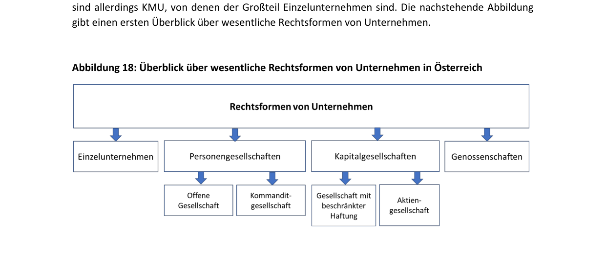
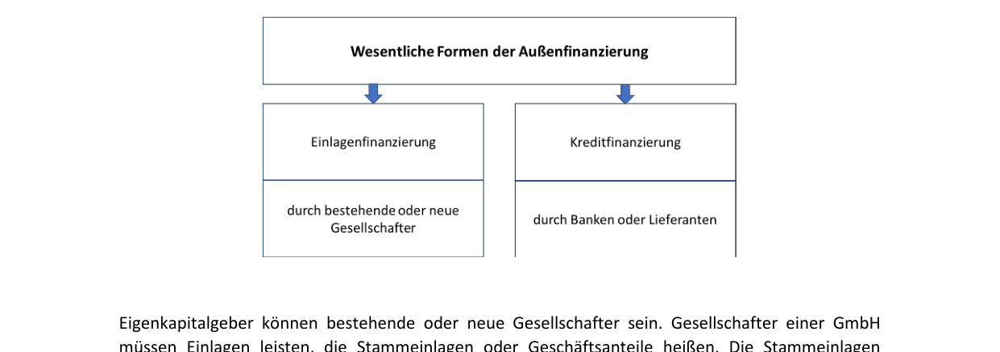
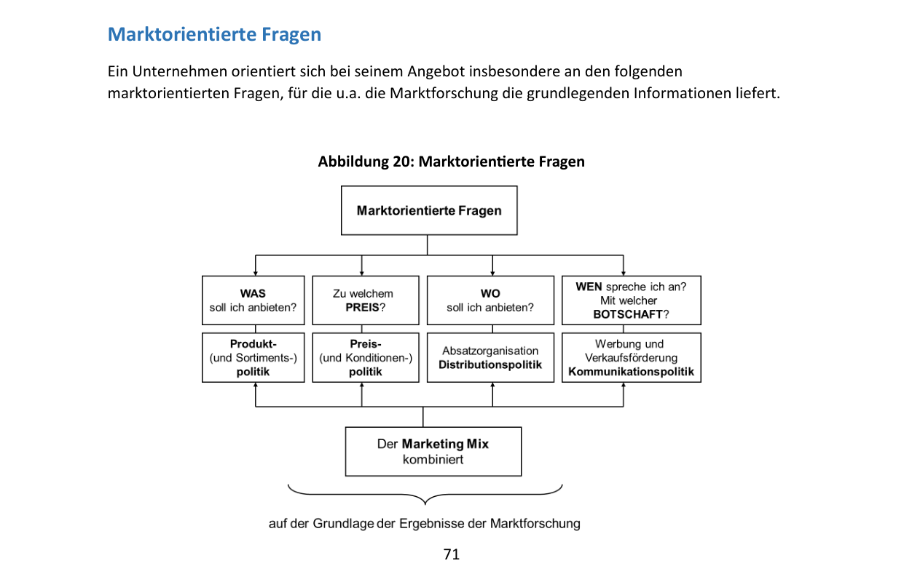
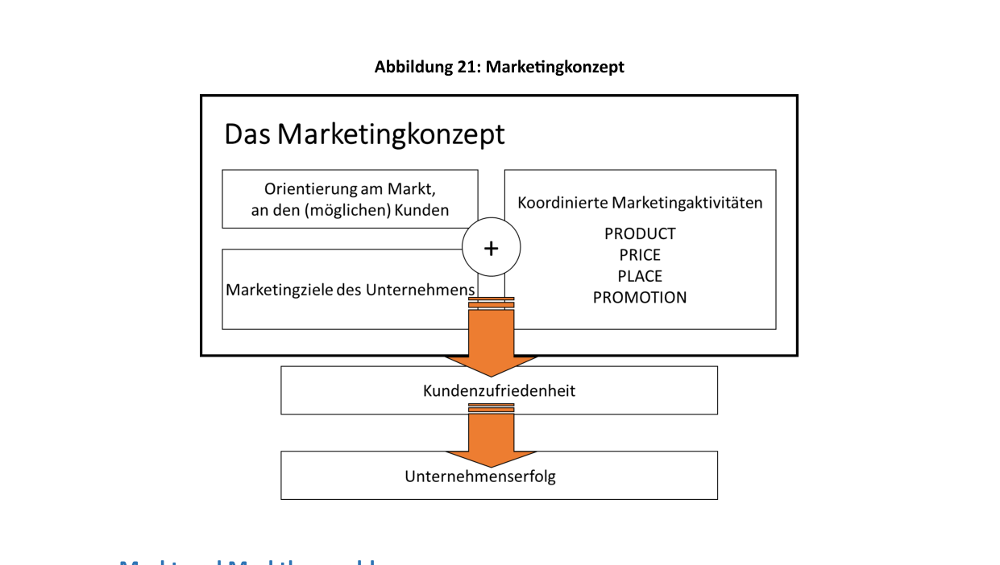
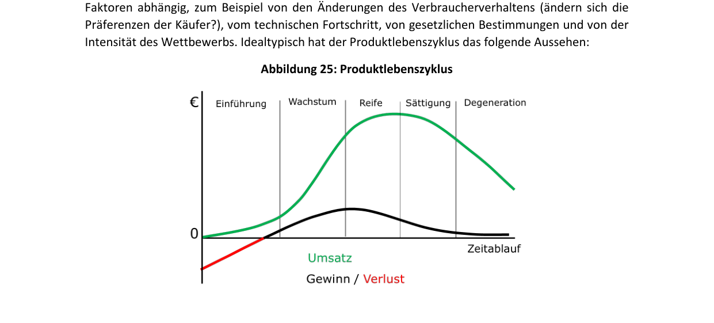
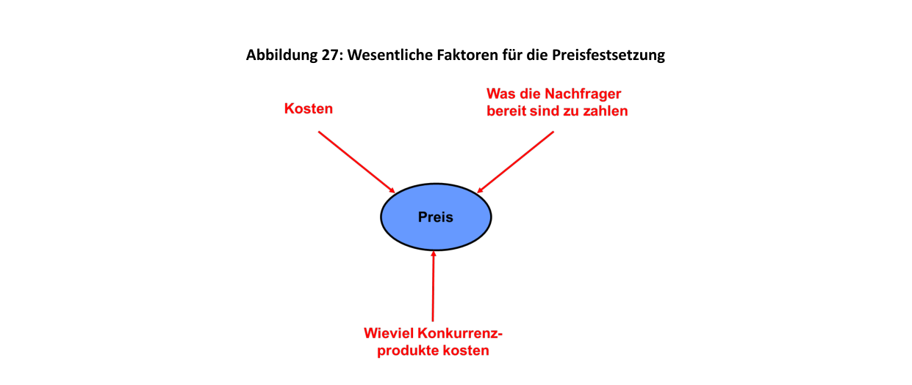
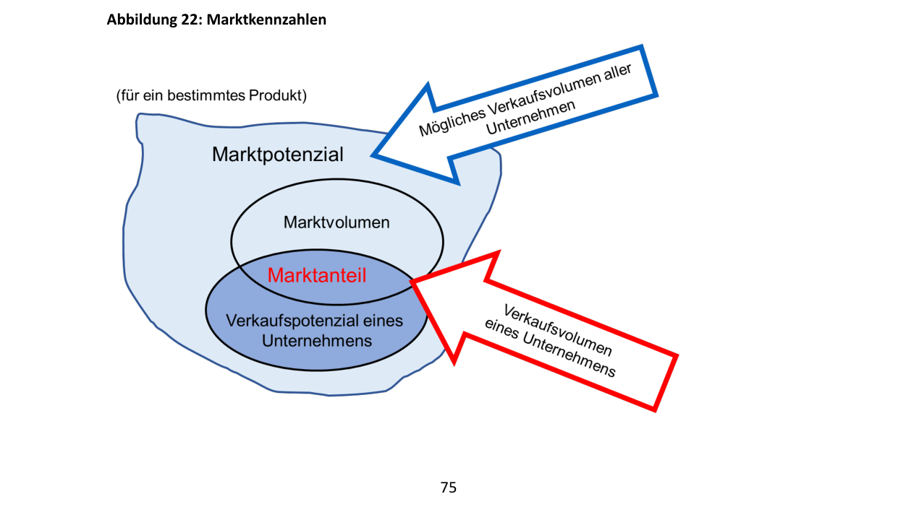
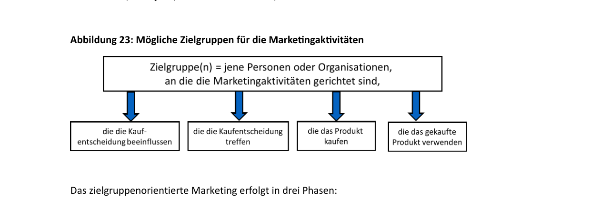
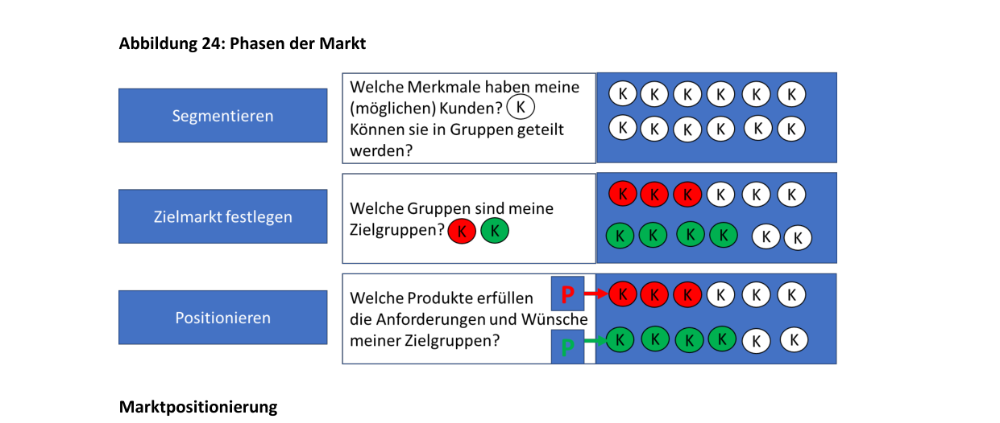

# Глава 3: Что экономическая деятельность означает для предприятий (Was Wirtschaften für Unternehmen bedeutet)

Предприятия ведут экономическую деятельность в условиях, схожих с условиями частных домохозяйств. Они точно так же сталкиваются с проблемой ограниченности ресурсов и должны тщательно планировать их использование. У них нет неограниченного количества денег или средств производства. Устойчивое ведение хозяйства важно для долгосрочного существования и успеха предприятия ничуть не меньше, чем для домохозяйства.

Предприятия должны планировать свои потребности и следить за наличием финансовых средств. Их финансовые цели схожи с целями домохозяйств: обеспечение платежеспособности, формирование резервов на случай чрезвычайных ситуаций, выгодное инвестирование и привлечение финансирования на оптимальных условиях. Однако хозяйственная деятельность предприятий имеет свою специфику и в большинстве случаев является гораздо более сложной. Эти вопросы подробно изучает дисциплина **«Экономика и управление предприятием» (Betriebswirtschaftslehre, BWL)**.

---

## 3.1 Что такое предприятие и какие виды предприятий существуют? (Was ist ein Unternehmen...)

> [!NOTE]
> **Определение предприятия**:
> Предприятия — это экономически самостоятельные организационные единицы, которые производят продукты и оказывают услуги для других. Их задача — выявлять или формировать потребности частных домохозяйств, других предприятий и/или государства и предлагать соответствующие блага.

Для создания своей продукции или услуг предприятия используют:

*   **Средства труда / Основные средства (Betriebsmittel)**: оборудование, машины, недвижимость, офисное оснащение.
*   **Материалы / Оборотные средства (Werkstoffe)**: сырье, вспомогательные материалы, покупные полуфабрикаты.
*   **Рабочую силу (Arbeitskräfte)**: трудовой вклад персонала.
*   **Ноу-хау и информацию (Know-how und Information)**.

Нанимая сотрудников, предприятия создают рабочие места. Конкурируя с другими фирмами, они разрабатывают инновации. 

Предприятия влияют на различные **целевые группы (Anspruchsgruppen / Stakeholder)**, от которых они также зависят:

1.  **Сотрудники (Mitarbeiter:innen)**: заинтересованы в безопасных, интересных и хорошо оплачиваемых рабочих местах.
2.  **Поставщики (Lieferant:innen)**: ожидают надежных деловых отношений и своевременной оплаты поставок.
3.  **Клиенты (Kund:innen)**: желают получать качественные продукты и услуги по выгодной цене.
4.  **Собственники / Инвесторы (Eigentümer:innen, Gesellschafter:innen, Geldgeber:innen)**: рассчитывают на успешное развитие компании и получение дохода на вложенный капитал.
5.  **Местные сообщества и государство (Gemeinde, Land)**: заинтересованы в создании рабочих мест и уплате налогов, а также ожидают соблюдения экологических норм и социальной ответственности.

---

### Юридическое определение предприятия в Австрии
Государство устанавливает правовые рамки для бизнеса. Законодательное определение закреплено в § 1 **Предпринимательского кодекса Австрии (Unternehmensgesetzbuch, UGB)**:

> [!NOTE]
> **§ 1(1) UGB**: Предпринимателем (Unternehmer) является тот, кто осуществляет деятельность предприятия.
> **§ 1(2) UGB**: Предприятием (Unternehmen) является любая рассчитанная на долгосрочную перспективу организация самостоятельной экономической деятельности, даже если она не направлена на получение прибыли.

Три основных признака предприятия с юридической точки зрения:

1.  **Направленность на долгосрочную перспективу (auf Dauer angelegt)**: деятельность носит систематический, а не разовый характер.
2.  **Самостоятельная экономическая деятельность (selbstständige wirtschaftliche Tätigkeit)**: осуществляется независимо и на собственный риск.
3.  **Необязательность прибыли**: даже некоммерческие организации (Non-Profit-Organisationen, NPO) могут признаваться предприятиями, если они ведут постоянную хозяйственную деятельность.

С экономической точки зрения предприятие теряет основу для существования, если оно не может работать хотя бы на уровне самоокупаемости (**kostendeckend**) и сохранять платежеспособность.

> [!NOTE]
> **Что такое прибыль и каково ее значение?**
> **Приводя к простому знаменателю**: получать прибыль (Gewinn) — значит зарабатывать больше, чем тратить (на бухгалтерском языке: доходы (*Erträge*) превышают расходы (*Aufwände*)).
> Прибыль необходима для выживания компании, поскольку она реинвестируется в производство, обеспечивая его конкурентоспособность и снижая риск **банкротства / несостоятельности из-за чрезмерной задолженности (Überschuldungsgefahr)** в периоды убытков.

---

### Добавочная стоимость (Wertschöpfung)
В процессе производства предприятия создают блага, стоимость которых превышает стоимость исходных сырья и материалов.

> [!NOTE]
> **Добавочная стоимость (Wertschöpfung)**:
> Разница между стоимостью готовой продукции предприятия (Endprodukt) и стоимостью промежуточных товаров и услуг (Vorleistungen), закупленных у внешних поставщиков.

*   *Пример*: Фирма производит велосипед рыночной стоимостью €500. Стоимость закупленных компонентов ( Vorleistungen) составляет €100. Созданная предприятием добавочная стоимость равна €400. Это не чистая прибыль предприятия, так как из этой суммы еще нужно оплатить труд сотрудников, амортизацию оборудования, налоги, аренду и т.д.

Добавочная стоимость лежит в основе расчета ВВП страны (как сумма добавочных стоимостей всех предприятий за вычетом промежуточного потребления).

---

### Секторы экономики (Wirtschaftssektoren)
Предприятия классифицируются по трем основным секторам:

1.  **Первичный сектор (primärer Sektor)**: Добыча сырья. Сюда относятся сельское и лесное хозяйство, рыболовство и горнодобывающая промышленность.
2.  **Вторичный сектор (sekundärer Sektor)**: Переработка сырья в готовую продукцию. Включает промышленное производство (промышленность), ремесла (строительство, столярные мастерские) и энергетику.
3.  **Третичный сектор (tertiärer Sektor)**: Сфера услуг. Включает торговлю, туризм, консалтинг (юридический, налоговый), банковское дело, страхование, здравоохранение, образование и транспорт.

По мере развития страны доля третичного сектора в ВВП растет. В Австрии на сферу услуг приходится около **70% ВВП**. Первичный сектор, несмотря на важность для продовольственной безопасности, обеспечивает лишь немногим более 1% совокупного результата экономики.

Предприятия также группируются по **отраслям (Branchen / Wirtschaftszweige)** — направлениям деятельности, в которых компании производят схожие продукты или услуги (например, строительная, фармацевтическая, туристическая, медийная отрасли).

---

### Размеры предприятий
Классификация предприятий по размеру важна для налогообложения, отчетности и получения субсидий. В ЕС используется понятие **KMU** (Кляйн- и Миттельунтернемен — *Kleinst-, kleine und mittlere Unternehmen / SMEs*):

| Категория предприятия | Число сотрудников | Выручка в год (Umsatz/Jahr) | или | Балансовая стоимость активов (Bilanzsumme) |
| :--- | :--- | :--- | :--- | :--- |
| **Микропредприятия (Kleinstunternehmen)** | до 9 | до €2 млн | | до €2 млн |
| **Малые предприятия (kleine Unternehmen)** | до 49 | до €10 млн | | до €10 млн |
| **Средние предприятия (mittlere Unternehmen)** | до 249 | до €50 млн | | до €43 млн |
| **Крупные предприятия (große Unternehmen)** | от 250 | более €50 млн | | более €43 млн |

> [!TIP]
> **Статистика по Австрии**:
>
> *   Около 99% всех австрийских компаний относятся к сектору **KMU**.
> *   Около 90% из них — микропредприятия (менее 10 сотрудников).
> *   Примерно 85% предприятий имеют годовой оборот менее €1 млн.
> *   В KMU занято около 2/3 всех работающих в стране граждан.
> *   Остальную треть оборота создают около 1 900 крупных компаний (крупнейшие по выручке в Австрии: OMV, Porsche Holding, Strabag, REWE, Spar, voestalpine, Mondi, ÖBB, Andritz, Red Bull).

---

## 3.2 Организационно-правовые формы предприятий (Rechtsformen von Unternehmen)

Выбор **организационно-правовой формы (Rechtsform)** определяет, кто руководит бизнесом, кто имеет право подписи договоров, кто предоставляет капитал и в каком объеме участники отвечают по долгам компании. Информация о зарегистрированных компаниях содержится в публичном реестре — **Коммерческом регистре (Firmenbuch)**.



---

### 1. Индивидуальное предприятие (Einzelunternehmen)
*   **Характеристика**: Компанией управляет одно физическое лицо, которое принимает все решения и несет все риски.
*   **Личность и капитал**: Собственник самостоятельно предоставляет весь капитал. Дополнительное финансирование обычно привлекается в виде банковских кредитов.
*   **Ответственность (Haftung)**:

> [!WARNING]
> Индивидуальный предприниматель несет **неограниченную личную ответственность (unbeschränkte Haftung)** по обязательствам своего предприятия. Это означает, что в случае долгов взыскание может быть обращено не только на имущество фирмы (betriebliches Vermögen), но и на все личное имущество предпринимателя (Privatvermögen).


В случае неудачи бизнеса предпринимателю-физическому лицу грозит процедура личного банкротства (**потребительского банкротства — Privatkonkurs / Schuldenregulierungsverfahren**).

---

### 2. Товарищества / Партнерства (Personengesellschaften)
Создаются при участии двух или более лиц, которые совместно вносят капитал и ведут деятельность.

*   **Открытое торговое товарищество (Offene Gesellschaft, OG)**: Все участники (партнеры) имеют право и обязанность управлять делами.

> [!WARNING]
> Все партнеры в OG несут **неограниченную и солидарную ответственность (solidarische Haftung)**. Солидарная ответственность означает, что кредитор может потребовать выплаты всего долга товарищества в полном объеме с любого из партнеров по своему выбору из его личных средств.


*   **Коммандитное товарищество (Kommanditgesellschaft, KG)**: Включает участников двух типов:
    1.  **Комплементарии (Komplementäre)**: действительные члены, несущие полную неограниченную личную ответственность и управляющие компанией (аналогично партнерам в OG).
    2.  **Коммандитисты (Kommanditisten)**: вкладчики, ответственность которых ограничена размером их зарегистрированного вклада в капитал (**Kapitaleinlage**). Они не участвуют в управлении, но имеют право контроля (проверка книг). Это позволяет привлекать партнеров с ограничением их рисков.

Товарищества обычно зависят от средств партнеров и кредитов банков, поскольку привлечение широкого круга инвесторов затруднено.

---

### 3. Хозяйственные общества / Корпорации (Kapitalgesellschaften)
Обладают статусом **юридического лица (juristische Person)**: они могут самостоятельно заключать сделки, владеть имуществом, подавать иски и выступать ответчиками в суде. Их деятельность осуществляют органы управления, состоящие из физических лиц.

*   **Общество с ограниченной ответственностью (Gesellschaft mit beschränkter Haftung, GmbH)**:
    *   Создается одним или несколькими участниками.
    *   **Уставный капитал (Stammkapital)**: должен составлять не менее **€10 000** (минимальный порог снижен с 1 января 2024 года, ранее составлял €35 000). Минимальный вклад одного участника (**Stammeinlage**) — €70. Не менее половины уставного капитала должно быть внесено деньгами, остальное допускается внести имуществом (Sacheinlage: компьютеры, авто).
    *   **Управление**: осуществляется одним или несколькими директорами (**Geschäftsführer:innen**), которые могут и не быть владельцами долей. Собственники получают доходы в виде распределяемой прибыли (Gewinnanteile / Dividenden) пропорционально своим долям и не отвечают по долгам GmbH своим личным имуществом (рискуют только внесенным вкладом).

*   **Гибкое капитальное общество (Flexible Kapitalgesellschaft, FlexKapG)**:
    *   Новая форма корпорации (введена в Австрии недавно), близкая к GmbH. Минимальный уставный капитал также составляет €10 000, но минимальный вклад участника снижен до **€1**.
    *   Позволяет выпускать **доли стоимости предприятия (Unternehmenswert-Anteile)** — специальный вид долей без права голоса на общем собрании, упрощающий участие сотрудников в прибыли компании.

*   **Акционерное общество (Aktiengesellschaft, AG)**:
    *   **Уставный капитал (Grundkapital)**: должен составлять не менее **€70 000** и разделен на акции (**Aktien**). Владельцы акций называются **акционерами (Aktionäre)**.
    *   **Ответственность**: акционеры не отвечают по обязательствам AG своим имуществом, они рискуют только деньгами, потраченными на покупку акций.
    *   **Органы управления**:
        *   **Правление (Vorstand)**: ведет текущие дела под свою ответственность и представляет общество вовне.
        *   **Наблюдательный совет (Aufsichtsrat)**: назначает членов правления и контролирует их деятельность.
        *   **Общее собрание акционеров (Hauptversammlung)**.

*   **Европейское акционерное общество (Societas Europaea, SE)**:
    *   Разновидность акционерного общества, действующая на единых правовых основаниях на всей территории ЕС/ЕЭЗ. Удобна для компаний с филиалами в разных странах ЕС (например, концерн Strabag). Минимальный капитал составляет **€120 000**.

---

### 4. Кооперативы (Genossenschaften)
*   **Цель**: Объединение не менее двух физических или юридических лиц для содействия доходам или хозяйственной деятельности своих членов (**Förderung des Erwerbs und der Wirtschaft der Mitglieder**), а не получение прибыли для самой организации.
*   *Примеры деятельности*: совместное использование оборудования, совместные закупки сырья или совместный сбыт продукции.
*   **Форма в Австрии**: «зарегистрированный кооператив» (**eingetragene Genossenschaft, e. Gen.**). На европейском уровне действует аналог — *Societas Cooperativa Europaea (SCE)*.
*   **Управление и особенности**:
    *   Вход новых членов и выход из кооператива максимально упрощены. Минимальный капитал законом не установлен. Члены вносят паевые взносы (Kapitaleinlage).
    *   Ответственность участников обычно ограничена размером пая или его кратной величиной (часто в двойном размере пая).
    *   Органы управления: Правление (Vorstand) и Общее собрание участников (Hauptversammlung).
    *   **Кооперативный принцип голосования (Kopfstimmrecht)**: на собрании каждый член имеет **ровно один голос**, независимо от размера его паевого взноса (в отличие от AG или GmbH, где сила голоса пропорциональна капиталу).

---

### Коммерческий регистр (Firmenbuch)
Это центральная публичная база данных, ведение которой осуществляется судами.

*   Регистрация **обязательна** для товариществ (OG, KG), корпораций (GmbH, AG) и кооперативов.
*   Индивидуальные предприниматели (Einzelunternehmen) обязаны регистрироваться только при превышении объема выручки в **€700 000 в год** за два года подряд (или более €1 млн за один год). Ниже этого порога регистрация является добровольной.
*   В регистре содержатся сведения о юридическом названии компании (**наименование фирмы — Firma**), месте нахождения (юридический адрес), целях деятельности, именах собственников/партнеров (кроме акционеров AG), размере вкладов в капитал и лицах, обладающих правом подписи и руководства (уполномоченных представлять компанию).


**Таблица 2: Сводная характеристика организационно-правовых форм (Zusammenfassende Darstellung der Merkmale der verschiedenen Rechtsformen)**

| Признак | Индивидуальное предприятие (Einzelunternehmen) | Открытое товарищество (Offene Gesellschaft - OG) | Коммандитное товарищество (Kommanditgesellschaft - KG) | Общество с огр. ответственностью (GmbH) | Акционерное общество (AG) / SE | Кооператив (Genossenschaft - e.Gen.) |
| :--- | :--- | :--- | :--- | :--- | :--- | :--- |
| **Кто управляет / ведет дела?** | Индивидуальный предприниматель | Все участники товарищества (минимум двое) | Комплементарии (действительные члены, минимум один) | Директоры (Geschäftsführer, минимум один) | Правление (Vorstand) | Правление (Vorstand) |
| **Кто является участником?** | Индивидуальный предприниматель | Участники OG (минимум двое) | Комплементарии (мин. один) и коммандитисты (вкладчики, мин. один) | Все учредители / владельцы долей, внесшие вклады | Акционеры, купившие хотя бы одну акцию | Члены кооператива |
| **Кто предоставляет капитал?** | Индивидуальный предприниматель | Участники OG | Комплементарий может внести, коммандитист обязан внести вклад | Участники GmbH | Акционеры путем покупки акций | Члены кооператива путем паевых взносов |
| **Есть ли минимальный капитал?** | Нет | Нет | Нет | Да, €10 000 (с 2024 года, FlexKapG также €10 000) | Да, €70 000 (для SE: €120 000) | Нет |
| **Кто отвечает по долгам предприятия?** | Лично предприниматель — неограниченно всем имуществом | Все участники лично, неограниченно и солидарно | Комплементарии лично и неограниченно; коммандитисты — только в пределах вклада | Никто лично; риски ограничены уставным вкладом в GmbH | Никто лично; риски ограничены стоимостью купленных акций | Члены кооператива своим паем (как правило, в двойном размере) |
| **Как привлечь доп. (собственный) капитал?** | Внесение средств самим владельцем | Вклады действующих участников | Увеличение вкладов или привлечение новых коммандитистов | Увеличение вкладов или прием новых участников | Выпуск (эмиссия) новых акций на фондовом рынке | Прием новых членов кооператива |


---

## 3.3 Как предприятия привлекают финансовые средства (Wie Unternehmen finanzielle Mittel aufbringen)

Финансирование необходимо компаниям как на этапе создания, так и в процессе текущей деятельности.

*   **Долгосрочная потребность в капитале**: Инвестиции (Investitionen) в основные фонды (здания, оборудование, автопарк, IT-инфраструктура).
*   **Краткосрочная потребность в капитале**: Текущие расходы (оборотный капитал) на закупку сырья и материалов, выплату заработной платы, оплату аренды и энергии до момента получения выручки от продаж.



### Собственный и заемный капитал (Eigen- und Fremdfinanzierung)
1.  **Собственный капитал (Eigenkapital)**: Капитал, предоставляемый учредителями (Eigentümer) или акционерами, включая деньги и имущественные вклады (Sacheinlagen).
    *   *Свойства*: Не подлежит обязательному возврату, находится в распоряжении компании неограниченно долго. Не требует обязательной выплаты процентов (доход выплачивается в виде дивидендов только при наличии прибыли). Наличие высокого собственного капитала укрепляет финансовую устойчивость компании.

2.  **Заемный капитал (Fremdkapital)**: Средства, привлекаемые от третьих лиц (банков, поставщиков).
    *   *Свойства*: Предоставляется на определенный срок и подлежит возврату. Требует обязательной уплаты процентов (Zinszahlungen), независимо от финансовых результатов компании. Кредиты (Kredite) — основная форма заемного капитала.


**Таблица 3: Сравнение характеристик собственного и заемного капитала (Merkmale von Eigen- und Fremdkapital)**

| Критерий сравнения | Собственный капитал (Eigenkapital) | Заемный капитал (Fremdkapital) |
| :--- | :--- | :--- |
| **На какой срок предоставляется?** | Долгосрочно, как правило, бессрочно (не подлежит возврату) | Краткосрочно или долгосрочно, строго на согласованный срок |
| **Какова плата за капитал?** | При наличии прибыли — дивиденды (выплата не гарантирована) | Обязательная уплата процентов (Zinsen), сам капитал подлежит возврату |
| **Есть ли право голоса / участия в управлении?** | Да, в разной степени в зависимости от правовой формы | Нет, кредиторы не имеют права вмешиваться в управление компанией |
| **Есть ли обеспечение возврата средств?** | Нет, риски полностью лежат на собственниках | Да, если предоставлен залог или иное обеспечение (залог имущества, поручительство) |


### Краткосрочное финансирование за счет поставщиков
Важным источником заемного капитала в текущей деятельности являются поставщики при продаже товаров «под расчет» / в кредит (покупка в рассрочку — **«auf Ziel»**).

*   **Обязательства по поставкам и услугам (Lieferverbindlichkeiten)**: возникают, когда поставщик предоставляет отсрочку платежа (например, 30 дней).
*   **Сконто (Skonto)**: скидка, предоставляемая за быструю оплату счета (например, скидка 2% при оплате в течение 7 дней вместо 30). Отказ от сконто ради использования полного срока отсрочки фактически означает привлечение дорогого кредита от поставщика под очень высокий эффективный процент. Часто в такой ситуации выгоднее взять краткосрочный кредит в банке (овердрафт по счету) для оплаты счета со скидкой сконто.

---

### Внутреннее и внешнее финансирование (Innen- und Außenfinanzierung)

#### 1. Внутреннее финансирование (Innenfinanzierung)
Источником средств является выручка от продаж самого предприятия.

*   **Самофинансирование (Selbstfinanzierung)**: Удержание и реинвестирование полученной прибыли ( Einbehalten von Gewinnen). Это увеличивает собственный капитал предприятия и делает его более устойчивым к кризисам:
    *   Снижается зависимость от банков.
    *   Отсутствуют процентные расходы.
    *   Накопленный капитал позволяет покрывать возможные убытки прошлых лет без риска банкротства.

*   **Финансирование за счет амортизационных отчислений (Abschreibungsfinanzierung)**:

> [!NOTE]
> **Амортизация (Abschreibung)**:
> Отражает постепенный износ и потерю стоимости оборудования, зданий, компьютеров в процессе эксплуатации. Сумма износа закладывается в цену готового продукта как расход (Aufwand), уменьшая бухгалтерскую прибыль. Однако амортизация не означает реального оттока денежных средств из компании.
> Вырученные деньги накапливаются внутри компании и могут быть временно использованы для других инвестиций до тех пор, пока не потребуется замена оборудования.


*   **Финансирование за счет оценочных обязательств / резервов (Rückstellungsfinanzierung)**:

> [!NOTE]
> **Резервы под будущие обязательства (Rückstellungen)**:
> Создаются в бухгалтерском учете под возможные будущие расходы, точные сроки или суммы которых пока не определены (расходы на судебные процессы, выплату будущих пенсий сотрудникам, неиспользованные отпуска).
> Создание резерва признается расходом текущего периода и уменьшает прибыль, но реальной выплаты денег в этот момент не происходит. Денежные средства остаются в распоряжении компании на долгое время (например, пенсионные резервы — на 20–30 лет) и выступают источником финансирования.


#### 2. Внешнее финансирование (Außenfinanzierung)
Капитал поступает в компанию из внешних источников.

*   **Долевое внешнее финансирование**: Вклады собственников (Einlagenfinanzierung). В GmbH это дополнительные вклады учредителей. В AG — выпуск новых акций (**эмиссия акций — Emission**). 
    *   *Акция*: ценная бумага (Wertpapier), подтверждающая долю инвестора в уставном капитале AG и дающая право на получение части прибыли (дивидендов) и участие в голосовании. Цена акции на рынке называется ее **курсом (Kurs)**. При увеличении капитала (**капиталоувеличении — Kapitalerhöhung**) действующие акционеры получают преимущественное право на покупку новых акций (**право подписки — Bezugsrecht**), чтобы сохранить свою долю участия.

*   **Заемное внешнее финансирование**: Кредиты банков или выпуск облигаций.
    *   **Облигации (Anleihen / Schuldverschreibungen / Renten / Bonds)**:

> [!NOTE]
> Облигация — это долговая ценная бумага, подтверждающая право ее владельца (кредитора) получить от эмитента (заемщика — крупной компании или государства) в установленный срок номинальную стоимость облигации и фиксированный или плавающий процент за пользование средствами.


Большие суммы сложно получить в виде одного кредита в банке, поэтому крупный заем (**номинал облигации — Anleihenominale**) дробится на мелкие доли (**номинал одной бумаги / номинал выпуска — Stückelung**), которые распродаются множеству инвесторов на фондовом рынке. Цена облигации на бирже называется ее **курсом**. В конце срока облигация погашается (**tilgen**) по номинальной стоимости.
Процент по облигации может быть фиксированным или плавающим (например, привязанным к ставке Euribor). Облигации с плавающей ставкой называют **флоатерами (Floater)**.

> [!NOTE]
> **Euribor (Euro Interbank Offered Rate)**:
> Средневзвешенная процентная ставка, по которой первоклассные европейские банки предоставляют друг другу краткосрочные необеспеченные кредиты в евро. Служит базовой процентной ставкой (Basiszinssatz) для многих финансовых инструментов.

---

## 3.4 На какие вопросы отвечает бухгалтерский учет и отчетность (Welche Fragen das Rechnungswesen beantwortet)

Бухгалтерский учет (Rechnungswesen) отражает все хозяйственные операции компании. Основные направления представлены в таблице:

| Вопрос | Направление бухгалтерского учета | Содержание |
| :--- | :--- | :--- |
| **Достаточно ли у компании денег для текущих платежей, есть ли дефицит средств?** | **Финансовый учет / Финансовое планирование (Finanzrechnung)** | Финансовые планы (бюджеты), расчет денежных потоков (Cashflow). |
| **Каким имуществом владеет компания и как оно профинансировано? Получена ли прибыль или убыток за период?** | **Бухгалтерский учет (Buchhaltung / externes Rechnungswesen)** | Составление Баланса (Bilanz) и Отчета о финансовых результатах (Gewinn- und Verlustrechnung, G&V). |
| **Сколько стоит производство единицы продукции? Каков вклад каждого продукта в покрытие постоянных затрат?** | **Учет затрат / Калькуляция (Kostenrechnung / internes Rechnungswesen)** | Расчет себестоимости продукции, маржинальный анализ (Deckungsbeitragsrechnung). |

---

### 1. Финансовый учет (Finanzrechnung)
Обеспечивает контроль за платежеспособностью (**ликвидностью — Liquidität**) компании. Фирма должна быть способна своевременно оплачивать все счета. Потеря платежеспособности ведет к банкротству (Insolvenz).

Для контроля ликвидности составляется **Финансовый план / Бюджет (Finanzplan / Budget)**:

*   Сопоставляются запланированные **поступления денежных средств (Einzahlungen, EZ)** и **выплаты денежных средств (Auszahlungen, AZ)** за определенный период (например, за месяц).
*   *Разница между поступлениями и выплатами*:
    *   **Притоки (EZ) > Вытоков (AZ)**: положительный результат, компания сохраняет ликвидность. Избыток средств можно выгодно инвестировать.
    *   **Вытоки (AZ) > Притоков (EZ)**: возникает дефицит средств. Требуются срочные меры (сокращение расходов, отсрочка платежей поставщикам, сокращение запасов, привлечение кредита овердрафт или взносов от собственников).

> [!IMPORTANT]
> **Разница между кассовым методом и методом начисления**:
> Понятия «поступление/выплата» (Einzahlung/Auszahlung) в финансовом планировании строго привязаны к движению живых денег на счетах или в кассе. Они не совпадают с понятиями доходов и расходов (Ertrag/Aufwand) в отчетности, которые начисляются в момент совершения сделки, независимо от фактической даты оплаты (например, амортизация признается расходом, но не сопровождается выплатой денег).

Разница между поступлениями и выплатами за период формирует **денежный поток (Cashflow)**. Положительный Cashflow свидетельствует о способности компании генерировать средства для развития и возврата долгов.

---

### 2. Бухгалтерский учет (Buchhaltung)
Каждое предприятие обязано вести учет операций для определения финансового результата и расчета налогов. Бухгалтерский учет называют **внешним (externes Rechnungswesen)**, так как он предоставляет информацию внешним пользователям: налоговой службе, банкам, инвесторам (акционерам), поставщикам и сотрудникам.

В зависимости от формы и размера бизнеса отчетность ведется в виде:

*   **Учета доходов и расходов (Einnahmen-Ausgaben-Rechnung, EAR)**: простая форма учета по кассовому методу. Разрешена для индивидуальных предпринимателей и товариществ с годовым оборотом менее **€700 000**.
*   **Двойной бухгалтерии (doppelte Buchhaltung)**: сложная система учета методом начисления. Обязательна для всех корпораций (GmbH, AG), а также для ИП и товариществ, превысивших лимит оборота в €700 000. Включает составление Баланса (Bilanz) и Отчета о финансовых результатах (Gewinn- und Verlustrechnung, G&V). Крупные компании обязаны публиковать отчетность в Коммерческом регистре.

---

### Баланс (Die Bilanz)
Баланс отражает состояние активов и капитала компании на определенный момент времени (обычно на 31 декабря).

> [!NOTE]
> **Структура Баланса**:
> Баланс состоит из двух частей, суммы которых должны быть равны (балансовое равенство):
>
> 1.  **Актив (Aktiva / Vermögen)**: левая сторона баланса. Показывает, **во что вложены средства** (использование средств — *Mittelverwendung*). Называется дебетовой стороной (Sollseite).
> 2.  **Пассив (Passiva / Kapital)**: правая сторона баланса. Показывает, **откуда привлечены средства** (источники финансирования — *Mittelherkunft*). Называется кредитовой стороной (Habenseite).

```
          АКТИВ (Aktiva / Vermögen)                  ПАССИВ (Passiva / Kapital)
   [Использование средств (Soll / Wofür)]       [Источники средств (Haben / Woher)]
  +---------------------------------------+    +------------------------------------+
  | А. Внеоборотные активы                |    | А. Собственный капитал             |
  |    (Anlagevermögen: здания, станки)   |    |    (Eigenkapital: вклады, прибыль) |
  |                                       |    |                                    |
  | Б. Оборотные активы                   |    | Б. Заемный капитал                 |
  |    (Umlaufvermögen: запасы, деньги)   |    |    (Fremdkapital: кредиты, долги)  |
  +---------------------------------------+    +------------------------------------+
  | Баланс (Итого активов)                | =  | Баланс (Итого пассивов)            |
  +---------------------------------------+    +------------------------------------+
```

*   **Внеоборотные активы (Anlagevermögen)**: имущество, предназначенное для долгосрочного использования на предприятии (более 1 года). Сюда входят недвижимость (земельные участки, здания), машины и оборудование, лицензии, патенты, а также долгосрочные финансовые вложения.
*   **Оборотные активы (Umlaufvermögen)**: активы, которые находятся на предприятии временно (менее 1 года) и постоянно меняют свою форму. Сюда входят запасы сырья и готовой продукции (Vorräte), дебиторская задолженность покупателей (Forderungen aus Lieferungen und Leistungen), остатки на банковских счетах и наличные деньги в кассе (Bankguthaben und Barbestand).
*   **Собственный капитал (Eigenkapital)**: чистые активы владельцев. Рассчитывается как разница между совокупными активами и обязательствами (заемным капиталом). Рост собственного капитала за год отражает полученную прибыль, снижение — убыток (**принцип двойного определения прибыли**).
*   **Заемный капитал (Fremdkapital)**: обязательства компании перед третьими лицами (кредиты банков, резервы под обязательства, задолженность перед поставщиками).
*   **Золотое правило баланса (goldene Bilanzregel)**:

> [!IMPORTANT]
> Внеоборотные активы (активы с долгосрочным связыванием капитала) должны финансироваться за счет долгосрочных пассивов — собственного капитала и долгосрочного заемного капитала.


---

### Отчет о финансовых результатах (Gewinn- und Verlustrechnung, G&V)
Отражает доходы и расходы компании за отчетный период (обычно за год). Расходы вычитаются из выручки от продаж (**Umsatzerlöse**).

*   *Расходы включают*: затраты на материалы (Materialaufwand), оплату труда персонала (Personalaufwand), амортизацию активов (Abschreibungen), аренду, проценты по кредитам, налоги.
*   **EBIT (Earnings Before Interest and Taxes)**: операционный результат компании (Ergebnis vor Zinsen und Steuern) до вычета процентов по кредитам и налогов.
*   **Финансовый результат (Finanzergebnis)**: разница между финансовыми доходами (проценты по вкладам) и расходами (проценты по кредитам).
*   **Чистая прибыль (Jahresergebnis / Gewinn)**: итоговый финансовый результат после уплаты всех расходов, процентов и налогов.

---

### Отчет о движении денежных средств (Cashflowrechnung)
Дополняет Баланс и G&V, показывая реальные изменения денежных средств. Отчет разбит на три раздела:

1.  **Денежный поток от операционной деятельности (Cashflow aus der Betriebstätigkeit / Operating Cashflow)**: Движение средств по основной деятельности компании. Показывает, зарабатывает ли бизнес деньги на своем продукте. Ключевой показатель для инвесторов.
2.  **Денежный поток от инвестиционной деятельности (Cashflow aus der Investitionstätigkeit / Investing Cashflow)**: Затраты на приобретение оборудования, недвижимости или доходы от их продажи. Обычно этот показатель отрицательный у растущих компаний.
3.  **Денежный поток от финансовой деятельности (Cashflow aus der Finanzierungstätigkeit / Financing Cashflow)**: Привлечение акционерного капитала, получение или возврат кредитов, выплата дивидендов.

---

### 3. Учет затрат (Kostenrechnung / internes Rechnungswesen)
Используется внутри компании для управленческих решений (расчет себестоимости единицы товара, ценообразование, контроль эффективности подразделений). Ведение учета затрат не требуется по закону, но необходимо для управления бизнесом.

Затраты (**Kosten**) представляют собой оцененное в денежной форме потребление ресурсов для достижения целей компании.

*   *Отличие затрат от расходов*: Учет затрат включает **вмененные издержки (kalkulatorische Kosten)**, которые отсутствуют в обычной бухгалтерии. Например, **вмененный доход предпринимателя (kalkulatorischer Unternehmerlohn)** — гипотетическая зарплата индивидуального предпринимателя или партнеров в OG, которую они могли бы получать, работая по найму в другом месте (альтернативные издержки их труда).

#### Классификация затрат
*   **Постоянные затраты (fixe Kosten)**: Не зависят от объема производства (аренда цеха, зарплата руководства, страховка, линейная амортизация оборудования).
*   **Переменные затраты (variable Kosten)**: Растут или снижаются пропорционально объему выпуска продукции (сырье, материалы, детали для сборки велосипеда).

#### Маржинальный анализ и точка безубыточности
Для анализа покрытия затрат используется **маржинальный доход / вклад на покрытие (Deckungsbeitrag, DB)**:

$$\text{Deckungsbeitrag (DB)} = \text{Цена продажи} - \text{Переменные затраты на единицу}$$

Маржинальный доход показывает, сколько средств от продажи одной единицы товара идет на покрытие постоянных затрат компании и формирование прибыли.

*   **Доля маржинального дохода / коэффициент покрытия (Deckungsquote)**: отношение маржинального дохода к цене продажи (в процентах).
    
    $$\text{Deckungsquote (\%)} = \frac{\text{Deckungsbeitrag (DB)}}{\text{Preis}} \times 100$$

> [!NOTE]
> **Точка безубыточности (Break-even Point / порог рентабельности)**:
> Объем продаж (в штуках или в денежном выражении), при котором совокупная выручка компании в точности равна ее совокупным затратам (прибыль равна нулю). Начиная с этой точки компания начинает получать прибыль.

Формула расчета выручки в точке безубыточности (**Break-even Umsatz**):

$$\text{Break-even Umsatz} = \frac{\text{Постоянные затраты (Fixkosten)}}{\text{Коэффициент покрытия (Deckungsquote)}} \times 100$$

*   *Пример*: Фирма выпускает велосипеды ценой €400. Переменные затраты на один велосипед равны €180.
    *   Маржинальный доход (DB) на единицу товара:
        $$\text{Deckungsbeitrag (DB)} = 400 - 180 = \text{€}220$$

    *   Коэффициент покрытия (Deckungsquote):
        $$\text{Deckungsquote} = \frac{220}{400} \times 100 = 55\%$$

    *   Если постоянные затраты фирмы составляют €4 млн, то для достижения точки безубыточности требуется оборот:
        $$\text{Break-even Umsatz} = \frac{4\,000\,000}{55} \times 100 \approx \text{€}7\,272\,727$$
    Для покрытия всех затрат компания должна сделать оборот не менее €7,3 млн.

---

## 3.5 Маркетинг — нет успеха без ориентации на рынок (Marketing — kein Erfolg ohne Marktorientierung)

Ориентация на рынок имеет решающее значение. Выпуск продукции, которая не находит спроса («производство мимо рынка»), ведет к убыткам и банкротству.

> [!NOTE]
> **Что такое маркетинг? (Was ist Marketing?)**
> Маркетинг — это не просто реклама. Это систематическая ориентация всего предприятия (всех его отделов и процессов) и его продуктового предложения на удовлетворение потребностей и желаний клиентов.

Задачи маркетинга:

1.  Выявить текущие и будущие потребности покупателей.
2.  Спланировать соответствующее предложение компании.
3.  Донести информацию о ценности предложения до клиентов (**коммуникация**).
4.  Установить цену, которую клиенты готовы и могут заплатить.
5.  Организовать доставку товара в нужное место и в нужное время (**распределение**).



Эти четыре направления составляют **Маркетинг-микс (Marketing Mix / 4 Ps)**.



---

### Элементы Маркетинг-микса (4 Ps)

```
                                      Маркетинг-микс (4 Ps)
                                               |
             +------------------+--------------+------------------+
             |                  |              |                  |
         Продукт               Цена          Сбыт             Коммуникации
        (Product)            (Price)        (Place)           (Promotion)
```

#### 1. Товарная политика (Produktpolitik / PRODUCT)
Определяет ассортимент товаров (Produktprogramm / Sortiment), дизайн продуктов, упаковку, бренд и послепродажное обслуживание. 

*   В маркетинге под **«продуктом»** понимаются не только физические товары (велосипед, пакет сахара), но и услуги (фитнес-клуб, консалтинг), идеи, организации, бренды, персоны и даже регионы или страны.


**Таблица 6: Основная и дополнительная полезность продукта (Grund- und Zusatznutzen eines Produkts)**

| Вид полезности (Nutzen) | Сущность | Пример (на примере велосипеда) |
| :--- | :--- | :--- |
| **Основная полезность (Grundnutzen)** | Первичная цель / базовое функциональное назначение продукта | Езда, перемещение из точки А в точку Б |
| **Дополнительная полезность (Zusatznutzen)** | Дополнительная ценность, выходящая за рамки базовых функций | |
| *   *Эстетическая/эмоциональная полезность (Erlebnisnutzen)* | Удовольствие, радость от использования продукта, чувство безопасности | Приятные ощущения от езды, уверенность в надежности и безопасности велосипеда |
| *   *Социальная полезность (Geltungsnutzen)* | Престиж, статус, признание со стороны окружающих | Престиж владения известным и дорогим брендом (например, велосипедом woom) |


#### Жизненный цикл продукта (Produktlebenszyklus)
Большинство товаров проходят на рынке определенные стадии развития:

1.  **Этап внедрения (Einführungsphase)**: Выпуск нового товара. Продажи растут медленно из-за слабой осведомленности клиентов. Высокие затраты на продвижение и разработку ведут к тому, что прибыль появляется только к концу этапа. При неудаче продукт уходит с рынка.
2.  **Этап роста (Wachstumsphase)**: Быстрый рост продаж и прибыли. Продуктом начинают интересоваться конкуренты, появляются первые аналоги. Важна ценовая политика для удержания доли.
3.  **Этап зрелости (Reifephase)**: Объем продаж достигает максимума. Однако прибыль начинает снижаться из-за обострения конкуренции и роста затрат на рекламу, скидки и акции.
4.  **Этап насыщения (Sättigungsphase)**: Продажи и прибыль падают. Рынок сжимается. Компания должна принять решение: перезапустить продукт с изменениями (**релонч — Relaunch**) или вывести его из ассортимента.
5.  **Этап спада / дегенерации (Degenerationsphase)**: Продукт приносится в жертву из-за чрезмерных затрат и падения спроса.



#### Меры товарной политики
*   **Инновация продукта (Produktinnovation)**: разработка нового товара. Может вести к углублению ассортимента (**дифференциация — Produktdifferenzierung**, например, выпуск новых моделей велосипедов) или его расширению (**диверсификация — Produktdiversifikation**, например, woom начинает выпускать спортивную одежду или шлемы).
*   **Модификация продукта (Produktvariation)**: изменение характеристик существующего товара (старая версия при этом снимается с производства).
*   **Элиминация продукта (Produktelimination)**: снятие устаревшего или нерентабельного товара с производства.

---

#### 2. Ценовая политика (Preispolitik / PRICE)
Определяет уровень цен, систему скидок, условия оплаты и доставки. Цена должна покрывать затраты предприятия и соответствовать ценности продукта в глазах покупателя.


*   **Факторы ценообразования (три кита ценообразования)**:
    1.  *Затраты (Kosten)*: нижняя граница цены (себестоимость).
    2.  *Цены конкурентов (Preise der Konkurrenz)*: ориентир на рынке.
    3.  *Готовность клиентов платить (Запрашиваемый объем спроса)*: верхняя граница цены.

*   Различают политику высоких цен (высокое качество, сильный бренд, USP) и политику низких цен / дисконтную политику.
*   **Нерациональное поведение покупателей**:
    *   *Эффект сноба (Snob-Effekt)*: покупка дорогого товара с целью демонстрации своего превосходства и статуса.
    *   *Эффект присоединения к большинству (Mitläufer-Effekt)*: покупка товара вслед за другими («эффект толпы»).
    *   *Эффект качества (Qualitätseffekt)*: подсознательная оценка дорогого товара как более качественного по сравнению с дешевым.

---

#### 3. Сбытовая политика (Distributionspolitik / PLACE)
Определяет пути движения товара от производителя к конечному клиенту (каналы распределения).

*   **Прямой сбыт (direkter Absatz)**: Производитель продает товар напрямую конечному потребителю (через собственный интернет-магазин, фирменные филиалы, отдел продаж завода).
*   **Косвенный сбыт (indirekter Absatz)**: В цепочку продаж включаются посредники — оптовые торговцы (Großhändler) и розничные магазины (Einzelhändler).
*   **Франчайзинг (Franchising)**: Особая форма сбыта, при которой правообладатель (**франчайзер**) передает независимому предпринимателю (**франчайзи**) за плату право использовать свою торговую марку, продукты и готовую бизнес-модель/маркетинговую концепцию (например, McDonald's). Франчайзи юридически независим, но обязан соблюдать стандарты сети.

---

#### 4. Коммуникационная политика (Kommunikationspolitik / PROMOTION)
Инструменты информирования и убеждения клиентов. Включает:

*   **Классическую рекламу (Werbung)**: размещение объявлений в СМИ, роликов на ТВ и радио, наружной рекламы (плакаты, тумбы), рекламы в интернете.


**Таблица 7: Классические средства и носители рекламы (Wesentliche klassische Werbemittel und Werbeträger)**

| Рекламные средства / Материал (Werbemittel) | Рекламоносители / Канал распространения (Werbeträger) |
| :--- | :--- |
| **Объявления, макеты (Anzeigen / Inserate)** | Ежедневные и еженедельные газеты, иллюстрированные журналы, специализированные издания, программы мероприятий и т.д. |
| **Теле- и радиоролики (TV-Spots, Radiospots)** | Телевидение, радиовещание |
| **Рекламные ролики и фильмы (Werbefilme)** | Кинотеатры, театры, концертные и выставочные залы и т.д. |
| **Плакаты, афиши, рекламные щиты (Plakate, Werbetafeln)** | Билборды, рекламные тумбы, остановки, общественный транспорт, спортивные арены и т.д. |
| **Рекламные письма, листовки, брошюры, каталоги** | Почта, курьерские службы доставки, раздача на мероприятиях, вкладыши в прессу и т.д. |
| **Баннеры, блоги, сообщения, сайты, форумы** | Социальные сети (Facebook, Instagram, YouTube, Twitter и т.д.) |


*   **Стимулирование сбыта (Verkaufsförderung)**: краткосрочные акции, купоны, скидки, дегустации.
*   **Личные продажи (Personal Selling)**: непосредственное общение продавца с покупателем (консультации в торговом зале).
*   **Связи с общественностью (Public Relations, PR)**: формирование положительного имиджа компании в обществе (пресс-конференции, спонсорство, пресс-релизы).
*   **Связи с инвесторами (Investor Relations)**: информирование акционеров и финансовых рынков.
*   **Социальные медиа (Social-Media-Marketing, SMM)**: продвижение бренда через социальные сети.
*   **Событийный маркетинг (Event Marketing)**: организация ярких мероприятий (выставки, показы мод, открытия филиалов, спортивные праздники) для эмоционального вовлечения клиентов.

---

### Аналитические показатели рынка (Marktkennzahlen)

> [!NOTE]
> **Определение рынка в маркетинге**:
> Это совокупность людей и/или предприятий, которые испытывают потребность, способную быть удовлетворенной с помощью предлагаемого компанией продукта.

Рынок характеризуется тремя основными показателями:

1.  **Рыночный потенциал (Marktpotenzial)**: Максимально возможный объем продаж определенного товара на рынке при идеальных условиях (если бы все потенциальные покупатели совершили покупку).
2.  **Рыночный объем (Marktvolumen)**: Фактический совокупный объем продаж данного товара всеми производителями на рынке за определенный период.
3.  **Доля рынка (Marktanteil)**: Доля продаж конкретного предприятия в общем рыночном объеме (в процентах).

*   **Абсолютная доля рынка (absoluter Marktanteil)**:
    $$\text{Absoluter Marktanteil (\%)} = \frac{\text{Umsatz des eigenen Unternehmens (Выручка компании)}}{\text{Marktvolumen (Общий объем рынка)}} \times 100$$

*   **Относительная доля рынка (relativer Marktanteil)**: сопоставляет выручку компании с выручкой ее крупнейшего конкурента:
    $$\text{Relativer Marktanteil} = \frac{\text{Umsatz des eigenen Unternehmens (Выручка компании)}}{\text{Umsatz des stärksten Konkurrenten (Выручка крупнейшего конкурента)}}$$
    Если относительная доля рынка **больше 1**, компания является лидером рынка (Marktführer).



---

### Сегментация рынка (Marktsegmentierung)
Покупатели имеют разные потребности. Поэтому рынок делится на группы со схожими характеристиками (**целевые аудитории / сегменты — Zielgruppen**): по возрасту, доходу, привычкам потребления.
Процесс включает три этапа:





1.  **Сегментирование (Segmentieren)**: разделение рынка на группы по выбранным критериям.
2.  **Определение целевого рынка (Zielmarkt festlegen)**: выбор сегментов, на которых компания сфокусирует свои усилия.
3.  **Позиционирование (Positionieren)**: создание уникального образа продукта в сознании целевой аудитории.

> [!NOTE]
> **Уникальное торговое предложение (Unique Selling Proposition, USP)**:
> Ключевое преимущество продукта, отличающее его от предложений конкурентов. Для *woom* это «высококачественные велосипеды, идеально адаптированные для детей и имеющие долгий срок службы».

---

### 🎓 Разбор экзаменационных вопросов и ловушек (Prüfungsfallen) по Главе 3

> [!WARNING]
> **Ловушка 1: Влияние операций на Cashflow (На примере Aufgabe 1)**
> Предприятие (например, *FunBike GmbH*) хочет быстро увеличить краткосрочный Cashflow.
>
> *   **Верно**: взять банковский кредит (**a: nimmt einen Bankkredit auf**) — это приток средств от финансовой деятельности (Einzahlung).
> *   **Верно**: принять нового партнера с денежным вкладом (**d: nimmt einen Gesellschafter mit Kapitaleinlage auf**) — это приток капитала (Einzahlung).
> *   **Верно**: отменить отсрочку платежей клиентам, заставив платить сразу (**e: gewährt kein Zahlungsziel mehr**) — ускоряет притоки (EZ).
> *   **НЕВЕРНО (категориальная ловушка)**: «emittiert Aktien» (**c**). Владелец — **GmbH** (общество с ограниченной ответственностью), а не AG. ООО не имеет акций и не может их выпускать! Только AG выпускает акции.
> *   **НЕВЕРНО**: покупка станка за €50 000 вместо его аренды за €1 000/месяц (**b**). В краткосрочной перспективе покупка приведет к оттоку €50 000, что снизит Cashflow (даже с учетом экономии на аренде).
> 
> **Ловушка 2: Структура и анализ баланса (На примере Aufgabe 2)**
>
> *   **Активы и капитал (Aktivtausch)**: Покупка акций другого предприятия за счет денежных средств на счете с целью долгосрочного владения (Finanzanlagen) — это **активный обмен (Aktivtausch)**. Активы (ценные бумаги) выросли, активы (деньги) снизились. Валюта баланса и собственный капитал (Eigenkapital) НЕ меняются.
> *   **Связь кредиторской задолженности**: Наличие статьи «Verbindlichkeiten aus Lieferungen und Leistungen» (например, €300 000) доказывает, что компания использует отсрочки платежей, т.е. покупает товары «auf Ziel», а **не оплачивает все счета мгновенно** (без отсрочки эта позиция равнялась бы 0).
> *   **Ликвидность активов**: Статьи актива баланса упорядочены по возрастанию ликвидности. Самой ликвидной позицией (с самым быстрым доступом к деньгам) является **«Bankguthaben und Barbestand»** (деньги в кассе и на счетах).
> 
> **Ловушка 3: Акции (Aktien) vs. Облигации (Anleihen) (На примере Aufgabe 10)**
>
> *   **Акции**: долевые ценные бумаги, формирующие собственный капитал (**Eigenkapital**). Срок владения не ограничен (нет даты погашения). Выплата дивидендов не гарантирована и зависит от прибыли.
> *   **Облигации**: долговые ценные бумаги, формирующие заемный капитал (**Fremdkapital**). Имеют конкретный срок погашения (Stichtag zur Rückzahlung). Выплата процентов (**Zinsen**) является обязательной, даже если компания терпит убытки.

