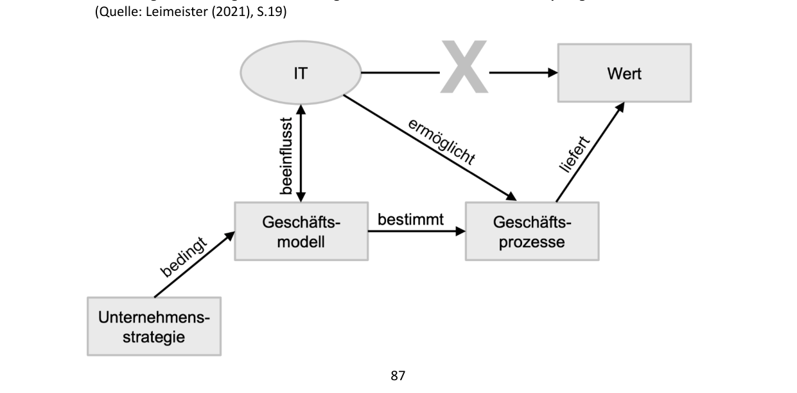
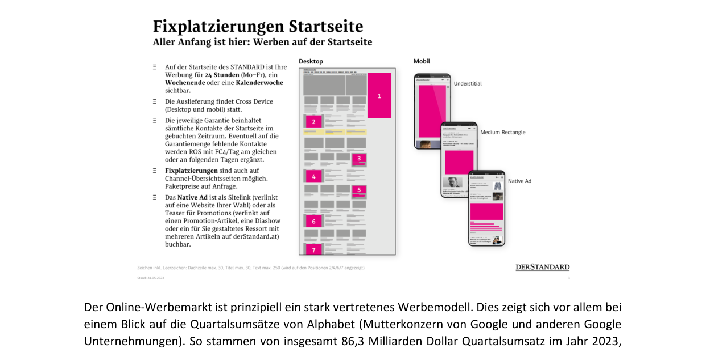
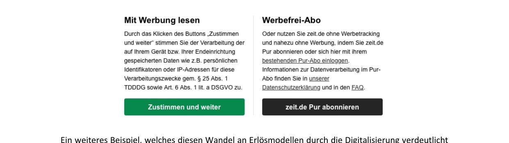
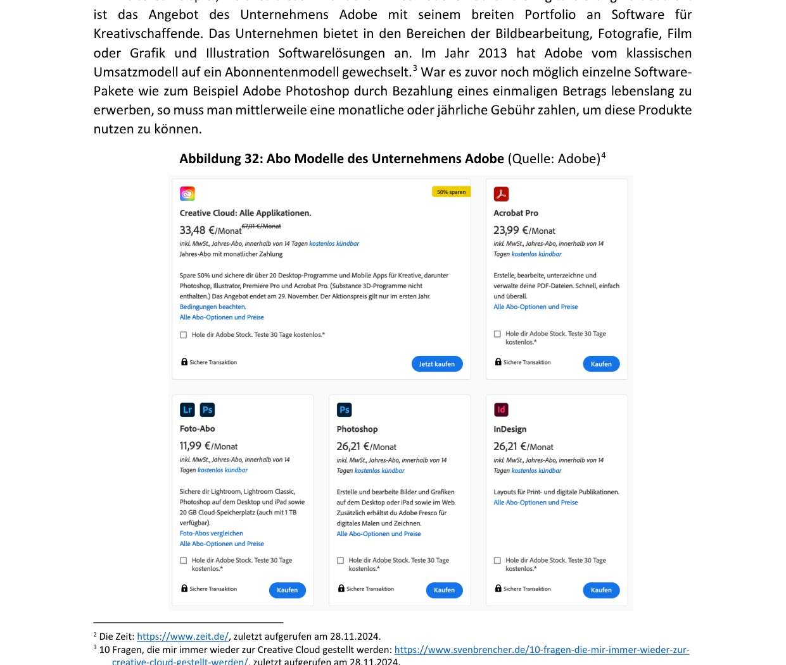
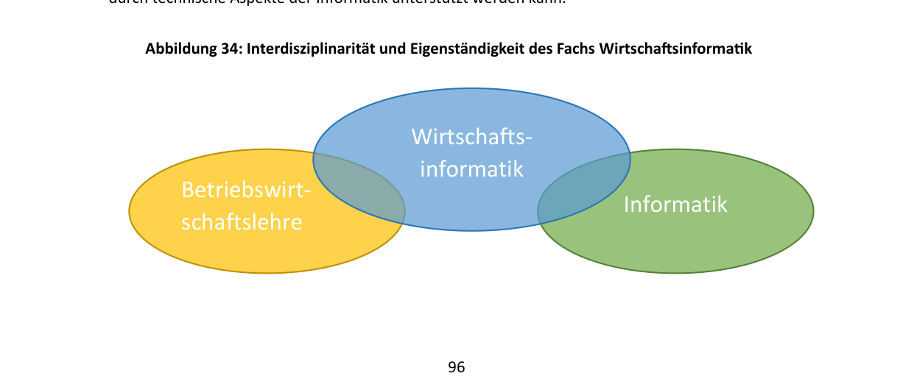
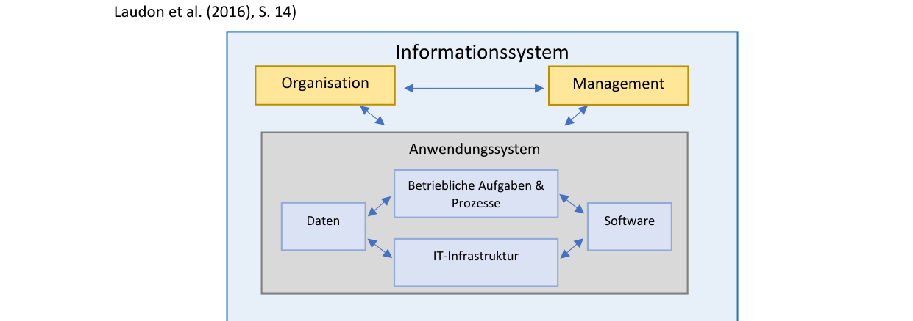
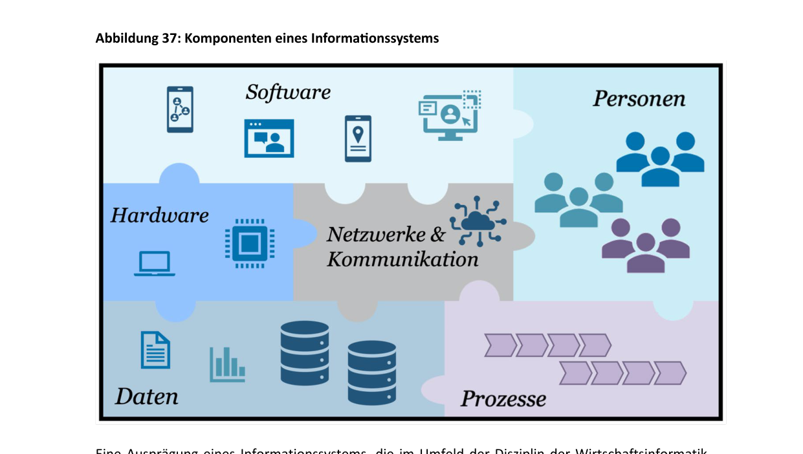

# Глава 4: Цифровизация и сетевое взаимодействие экономики и общества (Digitalisierung und Vernetzung von Wirtschaft und Gesellschaft)

Если вспомнить пример из первой главы и представить типичное утро рабочего дня, становится ясно, как быстро мы вступаем в контакт с технологиями. Нас будит будильник, настроенный на оптимальную фазу сна на основе цифровых измерений. Мы чистим зубы «умной» зубной щеткой, которая распознает, достаточно ли тщательно и с правильным ли давлением мы их почистили. За завтраком мы слушаем музыку через стриминговый сервис на смартфоне, который автоматически подключается к беспроводной акустической системе. Наконец, интеллектуальная система отопления фиксирует, что мы покинули квартиру, и на основе прогноза погоды и нашего личного календаря устанавливает оптимальную температуру, чтобы к нашему возвращению дома не было холодно. Мы повсеместно соприкасаемся с цифровыми системами. Без информационно-коммуникационных технологий это было бы невозможно.

Эта тенденция продолжается и в корпоративном мире: в супермаркетах системы автоматически фиксируют остатки товаров и при необходимости заказывают их. Службы доставки используют системы позиционирования и уведомлений, чтобы оперативно сообщать клиентам о своем местоположении. В производстве цифровые системы управляют технологическими процессами на заводе, быстро выявляют проблемы и реагируют на них. Во всех этих сферах используются различные цифровые системы для автоматизации, оптимизации или поддержки рабочих процессов.

Сегодня трудно найти сферу, в которой человек вообще не соприкасался бы с технологиями. Мы часто этого даже не замечаем. Английский термин **«ubiquitous computing»** (повсеместные / вездесущие вычисления — *Allgegenwärtigkeit von Rechensystemen*) сегодня актуален как никогда. Именно эти вопросы изучает дисциплина **«Экономическая информатика» (Wirtschaftsinformatik)**. Она исследует, как технологии могут поддерживать нас и какое влияние они оказывают на общество, экономику и личную жизнь.

---

## 4.1 Цифровая трансформация (Digitale Transformation)

Применение технологий меняет то, как предприятия ведут бизнес. Это касается управления внутренними процессами для повышения эффективности, взаимодействия с клиентами и создания новых продуктов и услуг.

> [!NOTE]
> **Что такое цифровизация и цифровая трансформация?**
> **Цифровизация (Digitalisierung)** — это применение цифровых информационно-коммуникационных технологий.
> **Цифровая трансформация (digitale Transformation)** — это изменения в экономике, государственном управлении и частной жизни, вызванные этим применением.

Возможности изменений на предприятии можно проиллюстрировать с помощью трех измерений цифровизации (по данным Leimeister 2021):

```
                     Потребитель / Клиент (externer Fokus - frontstage)
                                     ^
                                     |
                                     |     [Умные продукты и услуги]
                                     |            (Smarte Produkte)
                                     |           /
                                     |          /
                                     |         /
                                     |        /
                                     |       /
                                     |      /
                                     |     L
                                     +---------------------------------> Бизнес-процессы
                                                                 (interner Fokus - backstage)
```

1.  **Цифровые процессы (digitale Prozesse)**: Внутренний фокус предприятия («за кулисами» — *backstage*). Направлен на эффективное использование ресурсов для создания добавочной стоимости. Бизнес-процессы поддерживаются, расширяются и управляются цифровыми системами. Возникает цифровой бизнес-процесс.
2.  **Цифровой пользователь / потребитель (digitaler Nutzer / Konsument)**: Внешний фокус предприятия (*frontstage*). Представляет собой связь между клиентами и компанией. Включает разработку предложений с учетом требований и потребностей пользователей (физических лиц, других компаний или госструктур). Цифровизация позволяет точнее и эффективнее учитывать индивидуальные пожелания клиентов.
3.  **«Умные» продукты и услуги (smarte Produkte und Dienstleistungen)**: Результат создания добавочной стоимости, расширенный за счет технологий. Это может быть как простое цифровое дополнение (например, инструкция по сборке конструктора Lego в формате PDF вместо бумажной версии), так и глубокое изменение клиентского опыта (интерактивные цифровые миссии для наборов Lego, меняющие процесс игры и повышающие привязанность к продукту).

Слияние этих трех измерений формирует **цифровой бизнес (Digital Business)**.

---

### Бизнес-процессы
Основой цифровизации процессов является их четкое описание.

> [!NOTE]
> **Что такое бизнес-процесс? (Was ist ein Geschäftsprozess?)**
> Бизнес-процесс — это сложный рабочий процесс, состоящий из нескольких логически связанных действий, выполнение которых вносит вклад в достижение конкретной экономической цели предприятия. Процессы повторяемы, имеют четко определенное начало и один или несколько концов.

Фиксация и описание процесса в цифровой системе называется **документированием (Dokumentation)**. Визуальное представление процесса называют **моделью процесса (Prozessmodell)**. Она помогает сотрудникам (например, новым стажерам) быстро понять, как устроены закупки, сбыт или иные функции.

*   *Пример цифрового процесса*: Оформление онлайн-заказа в Thalia (www.thalia.at). Заказ автоматически обрабатывается системой, склад получает уведомление о необходимости собрать товар, сотрудники проверяют его наличие, готовят к отправке или выдаче в магазине, а клиент получает автоматические уведомления о статусе. Процесс завершается выдачей или доставкой товара, после чего система помечает заказ как выполненный.
*   *Пример цифровизации работы с клиентами*: Использование 3D-сканеров стопы в обувной сети Humanic (www.humanic.net). Сканер создает трехмерное изображение стопы покупателя и сохраняет его в личном кабинете. При онлайн-заказе или покупке в магазине система автоматически сверяет форму стопы с выбранной моделью обуви, подбирая идеальный размер и избавляя клиента от необходимости примерки и возврата товаров.

---

## 4.2 Новые продукты, услуги и бизнес-модели (Neue Produkte, Dienstleistungen...)

Цифровизация изменила привычные нам вещи: покупка билета на общественный транспорт в Вене осуществляется через приложение Wiener Linien; покупка продуктов питания — через онлайн-доставку (Gurkerl, Flink, Mjam) или интернет-магазины супермаркетов (Billa, Hofer, Interspar). Технологии создают новые бизнес-модели.

> [!NOTE]
> **Что такое бизнес-модель? (Was ist ein Geschäftsmodell?)**
> Бизнес-модель описывает, как предприятие на основе бизнес-идеи производит, предоставляет и продает продукт или услугу, чтобы в результате сопоставления использованных ресурсов и доходов получать прибыль (создавать добавочную стоимость).

Связь между использованием IT и созданием ценности (по Leimeister 2021) представлена на схеме:



IT позволяет масштабировать ценность: например, охватывать больше клиентов или предлагать индивидуализированные продукты.

*   *Пример трансформации бизнес-моделей в музыкальной индустрии*: В 2000 году доминировала продажа физических носителей (CD). Компания *Apple* совершила революцию, создав связку из плеера iPod и магазина *iTunes Store*, где можно было легально покупать отдельные песни вместо целых альбомов. Позже *Spotify* снова изменил эту модель, предложив вместо покупки треков потоковую трансляцию (**стриминг**) по подписке (Abonnentenmodell), предоставив миллионам пользователей доступ ко всей мировой библиотеке музыки за фиксированную ежемесячную плату.

---

### Цифровые бизнес-модели
1.  **Интернет-магазин (Webshop)**: прямая продажа товаров клиентам (Amazon.de, Zalando.de).
2.  **Онлайн-маркетплейс / Торговая площадка (Online-Handelsplatz)**: платформа, предоставляющая среду для встреч покупателей и продавцов (включая частных лиц), где владелец площадки берет комиссию или плату за размещение объявлений (willhaben.at, eBay.de).
3.  **Социальная сеть (soziales Netzwerk)**: виртуальное пространство для общения пользователей (Facebook, X, LinkedIn), зарабатывающее в основном на продаже рекламных площадей.

### Типы компаний по присутствию в сети
*   **Pure-Play**: компании, работающие исключительно в интернете и не имеющие физических филиалов для обслуживания клиентов (интернет-магазины, маркетплейсы).
*   **Clicks and Mortar**: компании, сочетающие традиционные физические магазины с цифровым присутствием (веб-сайт, онлайн-магазин, мобильное приложение), например, книжная сеть Thalia.

---

### Источники доходов в интернете (Erlösmodelle)

> [!NOTE]
> **Модель получения доходов (Erlösmodell)**:
> Определяет, каким образом предприятие зарабатывает деньги, генерирует выручку и получает прибыль.

Две основные модели получения доходов в эпоху цифровизации:

1.  **Рекламная модель (Werbemodell)**: Сайт предоставляет бесплатный контент или сервисы (Google, социальные сети, поисковые порталы Geizhals или Willhaben) для привлечения большого числа посетителей, а зарабатывает на показе рекламы рекламодателей.
    *   *AdWords*: продажа ключевых слов при поиске (Google).
    *   *AdSense*: размещение контекстной рекламы на сторонних ресурсах.
    *   *Баннерная реклама (Bannerwerbung)*.

2.  **Модель подписки (Abonnentenmodell)**: Взимание регулярной (ежемесячной/ежегодной) платы за доступ к части или всем услугам компании (Netflix, Spotify, подписки на цифровые версии газет).

> [!TIP]
> **Пример масштаба рекламной модели**:
> Квартальная выручка корпорации Alphabet (материнская компания Google) в 2023 году составила 86,3 млрд долларов США, из которых **65,5 млрд долларов США (около 75%)** принесла реклама.

*   *Пример перехода на модель подписки*: Компания *Adobe* (ПО для работы с графикой и видео) в 2013 году полностью свернула продажу бессрочных лицензий на свои программы (Photoshop, Premiere) за разовую плату и перешла на модель подписки *Creative Cloud*, требующую ежемесячных платежей.







---

## 4.3 Интернет как платформа для предприятий (Das Internet als Plattform...)

Центральным элементом цифровизации является Интернет.

> [!NOTE]
> **Что такое сеть? (Was ist ein Netzwerk / Rechnernetz?)**
> Это пространственно распределенная система станций передачи данных (компьютеров, планшетов, смартфонов), соединенных между собой коммуникационными устройствами и каналами связи для обмена данными. Канал связи может быть проводным или беспроводным (Wi-Fi).
> **Интернет (Internet)** — это глобальная физическая сеть сетей, связывающая компьютеры по всему миру посредством оптоволоконных кабелей, проложенных по дну океанов, спутниковых систем и локальных провайдеров.

---

### Отличие Интернета от World Wide Web (WWW)
В повседневной жизни эти понятия часто используют как синонимы, что неверно:

*   **Интернет (Internet)** — это глобальная физическая сеть (инфраструктура). Через нее работают многие службы: электронная почта (E-Mail), мессенджеры (WhatsApp), файловые хранилища и World Wide Web.
*   **World Wide Web (WWW / Web)** — это информационная служба (приложение), работающая поверх инфраструктуры Интернета. Она позволяет представлять информацию в виде веб-страниц, осуществлять транзакции и искать данные. Браузер (Web-Browser) служит интерфейсом доступа к WWW.

WWW был изобретен **Тимом Бернерсом-Ли** в 1989 году во время его работы в CERN (Женева). В 1990 году он опубликовал предложение по систематизации информации в сети — «Information Management: A Proposal».

Три фундаментальные технологии, лежащие в основе работы WWW:

1.  **HTTP (Hypertext Transfer Protocol)**: Протокол передачи гипертекста. Задает правила, по которым браузер запрашивает файлы у сервера, а сервер их отправляет.
2.  **HTML (Hypertext Markup Language)**: Язык разметки гипертекста. Используется для структурирования и отображения контента веб-страниц в браузере.
3.  **URL (Uniform Resource Locator)**: Единый указатель ресурса. Уникальный адрес, используемый для нахождения информации в сети.

> [!NOTE]
> **Что такое протокол? (Was ist ein Protokoll?)**
> В сфере IT под протоколом понимают **коммуникационный протокол (Kommunikationsprotokoll)**. Это набор точных правил и соглашений, определяющих, как компьютеры должны общаться друг с другом (формат сообщений, структура ответов, кодировка символов). Аналог в реальной жизни — правила оформления почтовых конвертов (указание адресата, адреса отправителя и индекса).

Связующими элементами веб-страниц являются **гиперссылки (Hyperlinks / Links)**, которые ведут на другие ресурсы, создавая единую сеть документов.

---

### Клиент-серверная архитектура (Client-Server-Architektur)
Браузер отправляет запрос (**Request**) серверу. Сервер (**Server**) — это компьютер, физически установленный в серверной комнате и ожидающий запросов из сети. На нем работает специальное программное обеспечение (**серверное ПО — Server Software**), которое обрабатывает запрос и отправляет браузеру ответ (**Response**), содержащий HTML-код веб-страницы или сообщение об ошибке.

> [!NOTE]
> **Клиент-серверная архитектура (Client-Server-Architektur)**:
> Модель взаимодействия компьютеров в сети, разделяющая участников на:
>
> *   **Клиентов (Clients)**: запрашивают услуги или данные (например, веб-браузер).
> *   **Серверов (Servers)**: предоставляют услуги или данные клиентам.

Возможность предоставления услуг в цифровой сети формирует **интернет-экономику (Internetökonomie)** — сферу экономической деятельности, использующую Интернет для проведения транзакций и создания ценности.

*   *Пример*: Портал *Refurbed* (www.refurbed.at) предоставляет цифровой маркетплейс для продажи восстановленной электроники. Сама платформа не владеет товарами, она объединяет предложения профессиональных продавцов и предоставляет интерфейс для покупателей, гарантируя безопасность сделки. Аналогичным маркетплейсом является австрийский портал объявлений *Willhaben* (www.willhaben.at).

---

## 4.4 Экономическая информатика как комплексная дисциплина (Wirtschaftsinformatik...)

**Экономическая информатика (Wirtschaftsinformatik)** изучает проектирование информационных систем, вопросы управления технологиями в бизнесе и этические последствия их внедрения.

### Междисциплинарный характер дисциплины
Экономическая информатика находится на стыке двух наук: **экономики предприятия (Betriebswirtschaftslehre)** и **информатики (Informatik)**.



В зависимости от угла зрения информационные системы изучаются в рамках двух подходов (перспектив):

1.  **Технический подход (техническая перспектива — *technische Sichtweise*)**: включает дисциплины:
    *   *Управление производством (Produktionsmanagement / Operations Management)*: управление процессами производства, логистическими цепочками (Supply Chain) и запасами.
    *   *Информатика (Informatik)*: разработка ПО (Software Engineering), семантическая паутина (Semantic Web), проектирование баз данных и алгоритмов.
    *   *Наука о данных (Data Science)*: работа с массивами данных сверхбольших объемов (**Big Data / Open Data**), статистика, машинное обучение и искусственный интеллект (AI/ML) для прогнозирования и принятия решений.

2.  **Поведенческий подход (поведенческая перспектива — *verhaltenswissenschaftliche Sichtweise*)**: рассматривает влияние систем на человека и общество. Включает дисциплины:
    *   *Экономика предприятия (Betriebswirtschaftslehre)*: использование технологий для повышения эффективности процессов и создания ценности, вопросы управления (Management), кибербезопасность, соблюдение законов о защите данных (Datenschutz).
    *   *Социология (Soziologie)*: влияние групп и организаций на проектирование систем и обратное влияние систем на общество.
    *   *Психология (Psychologie)*: человек как центральный компонент систем. Проектирование с учетом эмоций и потребностей людей, этические вопросы внедрения технологий, концепции **цифрового гуманизма (Digital Humanism)** и этичных вычислений (Ethical Computing).

> [!NOTE]
> **Что такое экономическая информатика как наука?**
> Предметом изучения экономической информатики являются информационные системы в экономике, государственном управлении и частной сфере. Дисциплина охватывает все виды деятельности, связанные с разработкой, внедрением, эксплуатацией, использованием и выводом из эксплуатации информационных систем.

---

### Прикладные и информационные системы

*   **Прикладная система / Прикладная программа (Anwendungssystem)**: Состоит из программного обеспечения (**приложений — Anwendungssoftware**), обрабатываемых данных (в базе данных) и аппаратной инфраструктуры (серверы, компьютеры), предназначенных для решения конкретной прикладной задачи (например, программа бухгалтерского учета, складская программа, Excel). В корпоративном контексте прикладные системы часто требуют индивидуальной адаптации (кастомизации) под нужды компании, что является сложным и дорогостоящим процессом.
*   **Информационная система (Informationssystem)**:

> [!NOTE]
> Информационная система — это система, созданная для конкретного предприятия, которая включает в себя различные прикладные системы и при этом интегрирована в организационную структуру и систему управления компании. Она состоит из людей и машин (компьютеров, ПО, сетей связи), которые производят, хранят, обрабатывают и используют информацию.




Человек является главным элементом информационной системы, так как именно люди создают и потребляют информацию, обрабатываемую машинами.

Компоненты информационной системы:

1.  **Программное обеспечение (Software)**.
2.  **Аппаратное обеспечение (Hardware)**.
3.  **Сети и коммуникации (Netzwerke & Kommunikation)**.
4.  **Данные (Daten)**.
5.  **Процессы (Prozesse)**.
6.  **Люди / Персонал (Personen)**.

### ERP-системы (Enterprise-Resource-Planning-System)
Классическим примером комплексной корпоративной информационной системы является **ERP-система**.



> [!NOTE]
> **ERP-система**:
> Информационная система управления ресурсами предприятия, предназначенная для интеграции, автоматизации и координации ключевых бизнес-процессов компании (бухгалтерия, закупки, складской учет, производство, продажи, управление кадрами) в единой базе данных.

*   *Пример ERP-системы*: Продукты немецкой компании **SAP** (www.sap.com) — одного из крупнейших разработчиков корпоративного ПО в мире (создана в 1972 году). Продукты компании (SAP R/3, SAP ERP, SAP Business Suite, современная версия — **SAP S/4HANA**) используются тысячами предприятий по всему миру.
*   Другие виды корпоративных систем:
    *   **CRM-системы** (Customer-Relationship-Management): управление взаимоотношениями с клиентами.
    *   **SCM-системы** (Supply-Chain-Management): управление цепочками поставок.
    *   **BI-системы** (Business-Intelligence): сбор и аналитика данных для принятия управленческих решений.

---

### 🎓 Разбор экзаменационных вопросов и ловушек (Prüfungsfallen) по Главе 4

> [!WARNING]
> **Ловушка 1: Изобретатель WWW vs. Создатель Интернета (На примере Aufgabe 8c)**
>
> *   Тим Бернерс-Ли в 1989 году изобрел **World Wide Web (WWW)**, работая в CERN.
> *   Он **НЕ** изобретал Интернет. Интернет как физическая сеть сетей существовал до WWW и служит инфраструктурой (платформой), на которой базируется WWW.
> *   *Экзаменационный вопрос*: Утверждение «Tim Berners-Lee hat... das Internet erfunden» является **НЕВЕРНЫМ**.
> 
> **Ловушка 2: Значение IP и его назначение (На примере Aufgabe 8d)**
>
> *   **IP** расшифровывается как **Internet Protocol** (а не *Identification Protocol*).
> *   IP-адрес используется для однозначной идентификации **технических устройств (компьютеров, узлов, серверов)** в сети, а **не конкретных людей (Personen)**.
> *   *Экзаменационный вопрос*: Утверждение «Das Internet verwendet... das "Identification Protocol (IP)" um... Personen in einem Netzwerk zu identifizieren» является **НЕВЕРНЫМ**.
> 
> **Ловушка 3: Междисциплинарный характер и перспективы Wirtschaftsinformatik (На примере Aufgabe 4)**
>
> *   Экономическая информатика находится на стыке **Betriebswirtschaftslehre (BWL)** и **Informatik**. Она не связана напрямую с политологией (Politikwissenschaft) или биологией (Biologie).
> *   Существуют только **две ключевые перспективы** дисциплины:
>     1.  **Техническая (technische Sichtweise)**: включает *Produktionsmanagement*, *Informatik* и *Data Science*.
>     2.  **Поведенческая (verhaltenswissenschaftliche Sichtweise)**: включает *Betriebswirtschaftslehre (BWL)*, *Soziologie* и *Psychologie*.
> *   *Экзаменационный вопрос*: Утверждение о наличии «биологической перспективы» является **НЕВЕРНЫМ**. Утверждение о связи с политологией — **НЕВЕРНЫМ**.
> 
> **Ловушка 4: Измерения цифровизации (На примере Aufgabe 12)**
>
> *   Три измерения цифровизации (по Leimeister):
>     1.  **Внутренний фокус (interner Fokus / backstage)**: цифровые бизнес-процессы.
>     2.  **Внешний фокус (externer Fokus / frontstage)**: цифровые пользователи/клиенты.
>     3.  **Результат (Output / Ergebnis)**: «умные» (smarte) продукты и услуги.
> *   *Экзаменационный вопрос*: Утверждение о том, что измерениями цифровизации являются «мобильные устройства, серверы и облачные вычисления», является **НЕВЕРНЫМ** (это компоненты IT-инфраструктуры, а не измерения цифровизации).

